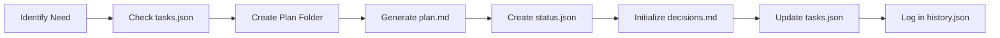

# 📋 Plan Creation and Management Workflow

## Overview

This document defines the standardized workflow for creating, managing, and storing implementation plans for the Varga AI project. Plans bridge the gap between high-level tasks in `tasks.json` and actual code implementation.

## 🎯 Purpose

Plans serve as:
- **Architectural blueprints** before implementation
- **Decision documentation** for future reference
- **Progress tracking** at a granular level
- **Knowledge base** of implementation patterns
- **Risk mitigation** through pre-planning

## 📁 Plan Storage Structure

```
.claude/
├── plans/
│   ├── {plan_name}/
│   │   ├── plan.md           # Main plan document
│   │   ├── status.json       # Progress tracking
│   │   ├── decisions.md      # Architectural decisions
│   │   └── notes/           # Research and working notes
│   │       ├── research.md
│   │       ├── alternatives.md
│   │       └── learnings.md
│   ├── plan_template.md      # Reusable template
│   └── README.md             # Plans directory guide
```

## 🏷️ Plan Naming Conventions

### Task-Based Plans
When creating a plan for a specific task from `tasks.json`:
```
Format: {TASK_ID}-{descriptive-name}/
Example: DB-001-postgresql-setup/
Example: AUTH-001-auth0-integration/
```

### Cross-Cutting Plans
For architectural or multi-task concerns:
```
Format: {descriptive-name}/
Example: multi-tenant-architecture/
Example: agent-testing-strategy/
```

## 📝 Plan Creation Workflow

### 1. Trigger Conditions

Create a plan when:
- User requests "plan mode" or "create a plan"
- Starting a P0 or P1 task from `tasks.json`
- Making architectural decisions
- Implementing complex features
- Facing multiple implementation options

### 2. Plan Creation Steps



#### Step-by-Step Process:

1. **Identify the scope**
   - Link to task ID if applicable
   - Define clear objectives
   - Identify dependencies

2. **Create plan folder**
   ```bash
   mkdir -p .claude/plans/{plan_name}/
   mkdir -p .claude/plans/{plan_name}/notes/
   ```

3. **Generate plan.md** using template
   - Fill in all required sections
   - Be specific about implementation steps
   - Include acceptance criteria

4. **Initialize status.json**
   ```json
   {
     "plan_name": "DB-001-postgresql-setup",
     "task_id": "DB-001",
     "status": "planning",
     "current_step": 0,
     "total_steps": 10,
     "started": "2025-01-11",
     "last_updated": "2025-01-11",
     "completed_steps": [],
     "blockers": [],
     "notes": []
   }
   ```

5. **Create decisions.md**
   - Document key architectural choices
   - Explain rationale
   - List alternatives considered

## 📊 Plan Lifecycle

### States
1. **planning** - Initial creation and design
2. **approved** - Ready for implementation
3. **in_progress** - Active implementation
4. **blocked** - Waiting on dependencies
5. **completed** - Successfully implemented
6. **archived** - No longer relevant

### Status Updates

Update `status.json` when:
- Starting a new step
- Completing a step
- Encountering blockers
- Making significant progress

Example update:
```json
{
  "current_step": 3,
  "completed_steps": [1, 2],
  "last_updated": "2025-01-11T14:30:00Z",
  "notes": ["PostgreSQL connection established", "Schema design complete"]
}
```

## 🔄 Integration Points

### With ExitPlanMode Tool
When using `ExitPlanMode`:
1. Automatically create plan folder
2. Save plan content to `plan.md`
3. Initialize `status.json`
4. Update `tasks.json` with plan reference

### With TodoWrite Tool
- Reference active plan in todos
- Link todo items to plan steps
- Update both todo and plan status

### With tasks.json
- Add `plan_location` field to task
- Update task status when plan completes
- Track plan progress in task notes

### With history.json
Log when:
- Plan created
- Major milestones reached
- Plan completed
- Significant decisions made

## 📋 Plan Template Structure

### plan.md Sections

```markdown
# Plan: [Title]

## Overview
- **Objective**: Clear goal statement
- **Task Reference**: Link to tasks.json ID
- **Scope**: What's included/excluded
- **Timeline**: Estimated duration

## Context
- **Current State**: Existing implementation
- **Dependencies**: Required components
- **Constraints**: Technical/business limitations
- **Stakeholders**: Who needs to know

## Approach
- **Strategy**: High-level approach
- **Key Decisions**: Major choices made
- **Alternatives Considered**: Other options evaluated
- **Rationale**: Why this approach

## Implementation Steps
1. **Step Title**
   - Description
   - Acceptance Criteria
   - Estimated Time
   - Dependencies
   - Sub-steps if needed

## Technical Details
- **File Structure**: New/modified files
- **APIs**: Endpoints and contracts
- **Database**: Schema changes
- **Configuration**: Settings required

## Testing Strategy
- Unit tests required
- Integration tests
- E2E scenarios
- Performance benchmarks

## Rollback Plan
- How to revert if issues
- Data migration reversal
- Feature flags

## Success Metrics
- Completion criteria
- Performance targets
- Quality metrics
```

## 🎯 Best Practices

### DO:
✅ Create plans for all P0 and P1 tasks  
✅ Update status.json immediately when progress occurs  
✅ Document all significant decisions in decisions.md  
✅ Link plans to tasks.json entries  
✅ Include specific file paths and code structures  
✅ Define clear acceptance criteria for each step  
✅ Consider rollback strategies upfront  

### DON'T:
❌ Create plans for trivial tasks  
❌ Leave plans in "planning" state indefinitely  
❌ Skip updating status when implementing  
❌ Ignore blockers - document them immediately  
❌ Create duplicate plans for the same task  
❌ Delete completed plans - archive instead  

## 🔍 Plan Discovery

### Finding Active Plans
```bash
# List all active plans
ls -la .claude/plans/

# Check plan status
cat .claude/plans/*/status.json | grep '"status"'

# Find plans for specific task
ls -la .claude/plans/ | grep "DB-001"
```

### At Session Start
1. Check for active plans in `.claude/plans/`
2. Review status.json for in-progress plans
3. Check for blockers needing attention
4. Continue from current_step

## 📈 Metrics and Reporting

Track in each plan:
- **Planning time**: Time to create plan
- **Implementation time**: Actual vs estimated
- **Deviation**: Changes from original plan
- **Blockers encountered**: Type and resolution time
- **Decisions pivoted**: What changed and why

## 🚨 When Plans Change

If implementation deviates from plan:
1. Update decisions.md with new decision and rationale
2. Modify plan.md steps if needed
3. Add note to status.json
4. Consider if tasks.json needs updating
5. Log significant changes in history.json

## 💾 Archival Process

When plan completes:
1. Set status to "completed" in status.json
2. Update task status in tasks.json
3. Log completion in history.json
4. Move to `.claude/plans/archive/` after 30 days
5. Keep for future reference

## 🔗 Quick Commands

```bash
# Create new plan
mkdir -p .claude/plans/{plan_name}/notes

# Check plan status
cat .claude/plans/{plan_name}/status.json

# Update plan progress
edit .claude/plans/{plan_name}/status.json

# View active plans
ls -la .claude/plans/ | grep -v archive

# Archive completed plan
mv .claude/plans/{plan_name} .claude/plans/archive/
```

## 📚 Examples

See `.claude/plans/DB-001-postgresql-setup/` for a complete example of:
- Properly structured plan.md
- Active status tracking
- Architectural decisions documentation
- Research notes organization

---

**Remember**: Plans are living documents. They should evolve as you learn, capture decisions as you make them, and serve as valuable documentation for future development.