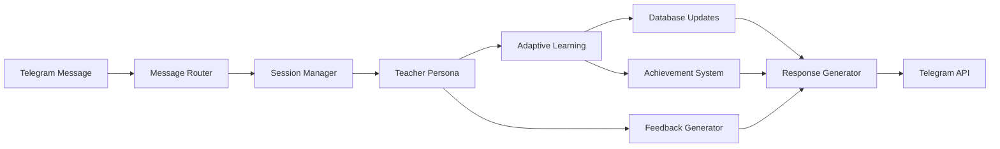

# Language Teacher Bot - API Specification

## Overview
This document defines the complete API specifications and shared context structures for the Language Teacher Bot system. All agents must implement and adhere to these interfaces for proper integration.

## Core Data Flow



## Shared Context API

### Context Passing Between Agents
```python
@dataclass
class SharedContext:
    """Complete context passed between all agents."""
    
    # User Information
    user_profile: UserProfile
    current_session: Optional[UserSession]
    user_preferences: Dict[str, Any]
    
    # Learning State
    recent_performance: List[ExerciseResult]  # Last 10 exercises
    active_learning_path: Optional[LearningPath]
    current_skill_levels: Dict[SkillType, float]
    
    # Session State
    conversation_history: List[Dict[str, str]]  # Recent conversation
    current_difficulty: float
    session_statistics: Dict[str, Any]
    
    # Gamification
    pending_achievements: List[Achievement]
    daily_stats: Dict[str, Any]
    streak_info: Dict[str, int]
    
    # Temporal Context
    time_of_day: str
    user_timezone: str
    session_start_time: datetime
    last_activity_time: datetime
    
    # Adaptive Insights
    learning_insights: Dict[str, Any]
    weakness_areas: List[SkillType]
    strength_areas: List[SkillType]
    recommended_focus: List[str]

# Context Builder Function (shared utility)
async def build_shared_context(user_id: int, 
                              session_id: Optional[str] = None) -> SharedContext:
    """Build complete shared context for user."""
    # Implementation coordinates across all repositories
    pass
```

## Agent Interface Specifications

### 1. Telegram Bot Specialist APIs

#### Core Orchestrator Interface
```python
class LanguageTeacherOrchestrator:
    """Main coordination interface for telegram bot specialist."""
    
    async def initialize(self) -> bool:
        """Initialize all teacher components and dependencies."""
        
    async def process_message(self, 
                            message: str, 
                            telegram_context: Dict[str, Any]) -> TeacherResponse:
        """Main message processing pipeline."""
        
    async def handle_command(self, 
                           command: str, 
                           args: List[str],
                           user_id: int) -> TeacherResponse:
        """Handle specific slash commands."""
        
    async def start_learning_session(self, 
                                   user_id: int,
                                   session_type: SessionType) -> UserSession:
        """Start new learning session."""
        
    async def end_learning_session(self, session_id: str) -> Dict[str, Any]:
        """End session and return summary statistics."""

    # Voice Processing Interface
    async def process_voice_message(self, 
                                  voice_file: bytes,
                                  user_id: int) -> TeacherResponse:
        """Process voice message for pronunciation practice."""
        
    # State Management
    async def save_session_state(self, session: UserSession) -> bool:
        """Persist session state."""
        
    async def restore_session_state(self, session_id: str) -> Optional[UserSession]:
        """Restore session from storage."""
```

#### Command Handler Interfaces
```python
class CommandHandler:
    """Base interface for command handlers."""
    
    @abstractmethod
    async def handle(self, 
                    args: List[str], 
                    user_profile: UserProfile,
                    context: SharedContext) -> TeacherResponse:
        """Handle specific command."""
        pass

# Specific Command Implementations Required
class LearnCommandHandler(CommandHandler):
    """Handle /learn command - start conversation practice."""
    
class PracticeCommandHandler(CommandHandler):
    """Handle /practice command - start exercises."""
    
class ProgressCommandHandler(CommandHandler):
    """Handle /progress command - show statistics."""
    
class SettingsCommandHandler(CommandHandler):
    """Handle /settings command - modify preferences."""
    
class VocabCommandHandler(CommandHandler):
    """Handle /vocab command - vocabulary practice."""
```

### 2. AI Engineer APIs

#### Adaptive Learning Interface
```python
class AdaptiveLearningSystem(AdaptiveLearningInterface):
    """Complete adaptive learning implementation."""
    
    # Core Learning Functions
    async def get_personalized_exercise(self, 
                                      user_profile: UserProfile,
                                      context: SharedContext) -> Exercise:
        """Get next exercise based on adaptive algorithm."""
        
    async def process_exercise_result(self, 
                                    result: ExerciseResult,
                                    context: SharedContext) -> Dict[str, Any]:
        """Process result and update learning models."""
        
    async def calculate_difficulty_adjustment(self, 
                                            user_id: int,
                                            recent_results: List[ExerciseResult]) -> float:
        """Calculate new difficulty level."""
        
    # Learning Path Management
    async def update_learning_trajectory(self, 
                                       user_id: int,
                                       progress: LearningProgress) -> LearningPath:
        """Update learning path based on progress."""
        
    async def recommend_study_focus(self, 
                                  user_id: int,
                                  context: SharedContext) -> List[SkillType]:
        """Recommend skills to focus on."""
        
    # Analytics and Insights
    async def generate_learning_insights(self, user_id: int) -> Dict[str, Any]:
        """Generate actionable learning insights."""
        
    async def predict_learning_outcomes(self, 
                                      user_id: int,
                                      proposed_exercises: List[Exercise]) -> Dict[str, float]:
        """Predict learning outcomes for exercise sequence."""
```

#### Spaced Repetition Interface
```python
class SpacedRepetitionManager:
    """Manages spaced repetition for vocabulary and concepts."""
    
    async def schedule_review(self, 
                            user_id: int,
                            item_id: str,
                            performance_quality: int) -> datetime:
        """Schedule next review using SM-2 algorithm."""
        
    async def get_due_reviews(self, user_id: int) -> List[VocabularyItem]:
        """Get items due for review."""
        
    async def add_new_vocabulary(self, 
                               user_id: int,
                               word: str,
                               translation: str,
                               context: str) -> VocabularyItem:
        """Add new vocabulary to spaced repetition system."""
        
    async def update_retention_model(self, 
                                   user_id: int,
                                   review_results: List[ReviewResult]) -> None:
        """Update retention prediction models."""
```

#### Analytics Interface  
```python
class LearningAnalytics:
    """Comprehensive learning analytics system."""
    
    async def calculate_learning_metrics(self, 
                                       user_id: int,
                                       time_period: timedelta) -> Dict[str, float]:
        """Calculate comprehensive learning metrics."""
        
    async def identify_learning_patterns(self, user_id: int) -> Dict[str, Any]:
        """Identify user's learning patterns and preferences."""
        
    async def generate_progress_report(self, 
                                     user_id: int) -> Dict[str, Any]:
        """Generate detailed progress report."""
        
    async def predict_mastery_timeline(self, 
                                     user_id: int,
                                     target_skills: List[SkillType]) -> Dict[SkillType, timedelta]:
        """Predict time to master specific skills."""
```

### 3. Prompt Engineer APIs

#### Teacher Persona Interface
```python
class ConversationTeacher(TeacherPersona):
    """Conversational practice teacher implementation."""
    
    async def initiate_conversation(self, 
                                  user_profile: UserProfile,
                                  context: SharedContext) -> TeacherResponse:
        """Start natural conversation based on user level and interests."""
        
    async def continue_conversation(self, 
                                  user_message: str,
                                  conversation_state: Dict[str, Any],
                                  context: SharedContext) -> TeacherResponse:
        """Continue conversation naturally while teaching."""
        
    async def integrate_teaching_moment(self, 
                                      conversation_context: Dict[str, Any],
                                      teaching_opportunity: Dict[str, Any]) -> TeacherResponse:
        """Naturally integrate teaching into conversation."""
        
    async def handle_error_correction(self, 
                                    user_input: str,
                                    detected_errors: List[Dict[str, Any]],
                                    context: SharedContext) -> TeacherResponse:
        """Provide gentle error correction within conversation."""

class HomeworkTeacher(TeacherPersona):
    """Structured exercise teacher implementation."""
    
    async def present_exercise(self, 
                             exercise: Exercise,
                             user_profile: UserProfile,
                             context: SharedContext) -> TeacherResponse:
        """Present exercise with clear instructions."""
        
    async def evaluate_exercise_response(self, 
                                       user_response: str,
                                       exercise: Exercise,
                                       context: SharedContext) -> TeacherResponse:
        """Evaluate response and provide detailed feedback."""
        
    async def create_custom_exercise_sequence(self, 
                                            skill_focus: SkillType,
                                            user_profile: UserProfile,
                                            context: SharedContext) -> List[Exercise]:
        """Create personalized exercise sequence."""
        
    async def provide_detailed_explanation(self, 
                                         concept: str,
                                         user_level: ProficiencyLevel,
                                         context: SharedContext) -> TeacherResponse:
        """Provide detailed concept explanation."""
```

#### Conversation Flow Interface
```python
class ConversationFlowManager:
    """Manages natural conversation flow and state."""
    
    async def analyze_conversation_state(self, 
                                       conversation_history: List[Dict[str, str]],
                                       current_message: str) -> Dict[str, Any]:
        """Analyze current conversation state and context."""
        
    async def determine_response_strategy(self, 
                                        conversation_analysis: Dict[str, Any],
                                        user_profile: UserProfile) -> str:
        """Determine best response strategy."""
        
    async def generate_natural_transition(self, 
                                        from_topic: str,
                                        to_topic: str,
                                        user_level: ProficiencyLevel) -> str:
        """Generate natural topic transition."""
        
    async def inject_exercise_naturally(self, 
                                      conversation_context: Dict[str, Any],
                                      target_exercise: Exercise) -> str:
        """Naturally integrate exercise into conversation."""
```

#### Feedback Generation Interface
```python
class PersonalizedFeedbackGenerator:
    """Generates personalized, effective feedback."""
    
    async def generate_error_feedback(self, 
                                    error_analysis: Dict[str, Any],
                                    user_profile: UserProfile,
                                    context: SharedContext) -> FeedbackResponse:
        """Generate personalized error correction feedback."""
        
    async def generate_encouragement(self, 
                                   performance_trend: List[float],
                                   user_profile: UserProfile) -> str:
        """Generate appropriate encouragement message."""
        
    async def suggest_improvement_strategies(self, 
                                           weakness_areas: List[SkillType],
                                           user_profile: UserProfile) -> List[str]:
        """Suggest specific improvement strategies."""
        
    async def create_progress_celebration(self, 
                                        achievements: List[Achievement],
                                        milestones: List[str]) -> str:
        """Create celebratory message for progress."""
```

## Database Interface Specifications

### Repository Pattern Implementation
```python
# All repositories must implement these patterns:

class BaseRepository:
    """Base repository with common functionality."""
    
    def __init__(self, db_manager: DatabaseManager):
        self.db = db_manager
        
    async def create(self, entity: Any) -> Any:
        """Create new entity."""
        
    async def get_by_id(self, entity_id: Any) -> Optional[Any]:
        """Get entity by ID."""
        
    async def update(self, entity: Any) -> bool:
        """Update existing entity."""
        
    async def delete(self, entity_id: Any) -> bool:
        """Delete entity."""
        
    async def find_by_criteria(self, criteria: Dict[str, Any]) -> List[Any]:
        """Find entities matching criteria."""

# Required Repository Implementations:
class UserRepository(BaseRepository):
    # User management operations
    
class SessionRepository(BaseRepository):
    # Session state management
    
class ExerciseRepository(BaseRepository):
    # Exercise and result management
    
class ProgressRepository(BaseRepository):
    # Learning progress tracking
    
class VocabularyRepository(BaseRepository):
    # Spaced repetition vocabulary
    
class AchievementRepository(BaseRepository):
    # Gamification achievements
    
class AnalyticsRepository(BaseRepository):
    # Performance analytics storage
```

## Event System Specification

### Inter-Agent Event Bus
```python
@dataclass
class AgentEvent:
    """Event structure for inter-agent communication."""
    event_type: str
    user_id: int
    source_agent: str
    target_agent: Optional[str]
    data: Dict[str, Any]
    timestamp: datetime
    correlation_id: str

class EventBus:
    """Event bus for agent coordination."""
    
    async def publish(self, event: AgentEvent) -> None:
        """Publish event to interested agents."""
        
    async def subscribe(self, 
                      event_type: str,
                      callback: Callable[[AgentEvent], Awaitable[None]],
                      agent_id: str) -> None:
        """Subscribe to event type."""
        
    async def unsubscribe(self, event_type: str, agent_id: str) -> None:
        """Unsubscribe from event type."""

# Required Event Types:
EVENT_TYPES = {
    "session_started": "User started learning session",
    "exercise_completed": "User completed an exercise",
    "level_up": "User advanced to next level",
    "achievement_unlocked": "User unlocked achievement",
    "weakness_identified": "Learning weakness identified",
    "session_ended": "Learning session ended",
    "streak_updated": "Daily streak updated",
    "difficulty_adjusted": "Exercise difficulty adjusted",
    "vocabulary_learned": "New vocabulary item learned",
    "error_pattern_detected": "Recurring error pattern found"
}
```

## Integration Testing Interfaces

### Test Coordination Interface
```python
class IntegrationTestCoordinator:
    """Coordinates integration testing across agents."""
    
    async def run_full_user_journey_test(self, 
                                       scenario: str) -> TestResult:
        """Run complete user journey integration test."""
        
    async def test_agent_communication(self, 
                                     agent_pairs: List[Tuple[str, str]]) -> TestResult:
        """Test communication between agent pairs."""
        
    async def verify_data_consistency(self) -> TestResult:
        """Verify data consistency across all repositories."""
        
    async def load_test_concurrent_users(self, 
                                       user_count: int) -> TestResult:
        """Test system with concurrent users."""

# Required Test Scenarios:
TEST_SCENARIOS = [
    "beginner_first_lesson",
    "intermediate_conversation_practice", 
    "advanced_homework_session",
    "voice_pronunciation_practice",
    "achievement_unlock_sequence",
    "difficulty_adaptation_flow",
    "session_recovery_after_timeout",
    "multi_skill_practice_session"
]
```

## Performance Requirements

### Response Time SLAs
- Message processing: < 2 seconds
- Exercise generation: < 3 seconds  
- Voice transcription: < 5 seconds
- Progress analytics: < 4 seconds
- Database queries: < 500ms

### Scalability Targets
- Concurrent users: 1000+
- Messages per minute: 10,000+
- Database transactions/sec: 500+
- Memory usage per user: < 50MB
- Storage per user: < 100MB

## Security Requirements

### Data Protection
```python
class SecurityInterface:
    """Security requirements for all components."""
    
    async def encrypt_sensitive_data(self, data: str) -> str:
        """Encrypt sensitive user data."""
        
    async def validate_user_permissions(self, 
                                      user_id: int,
                                      action: str) -> bool:
        """Validate user permissions for action."""
        
    async def audit_log_action(self, 
                             user_id: int,
                             action: str,
                             details: Dict[str, Any]) -> None:
        """Log user action for audit trail."""
        
    async def sanitize_user_input(self, user_input: str) -> str:
        """Sanitize user input for security."""
```

## Error Handling Specifications

### Standardized Error Responses
```python
@dataclass
class TeacherError:
    """Standardized error structure."""
    error_code: str
    error_message: str
    user_friendly_message: str
    recovery_suggestions: List[str]
    severity: str  # "low", "medium", "high", "critical"

class ErrorHandler:
    """Standard error handling across all agents."""
    
    async def handle_teacher_error(self, error: Exception) -> TeacherError:
        """Convert exception to standardized error."""
        
    async def log_error_with_context(self, 
                                   error: TeacherError,
                                   context: SharedContext) -> None:
        """Log error with full context."""
        
    async def attempt_recovery(self, 
                             error: TeacherError,
                             context: SharedContext) -> Optional[TeacherResponse]:
        """Attempt automatic error recovery."""
```

This API specification ensures all agents work together seamlessly while maintaining clear separation of responsibilities and consistent interfaces.