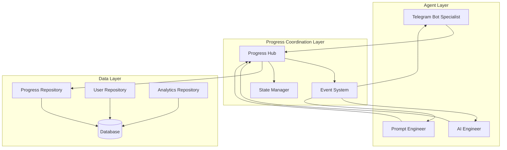

# Progress Tracking System - Cross-Agent Coordination

## Overview
Centralized progress tracking system that coordinates learning progress across all agents and ensures consistent state management throughout the language learning experience.

## Architecture

### Progress Coordination Hub


## Progress Hub Implementation

### Core Progress Coordinator
```python
# progress_coordination_hub.py
class ProgressCoordinationHub:
    """Central hub for coordinating progress across all agents."""
    
    def __init__(self, 
                 event_bus: EventBus,
                 progress_repo: ProgressRepository,
                 user_repo: UserRepository,
                 analytics_repo: AnalyticsRepository):
        self.event_bus = event_bus
        self.progress_repo = progress_repo
        self.user_repo = user_repo
        self.analytics_repo = analytics_repo
        self.state_cache = {}
        
    async def initialize(self) -> None:
        """Initialize progress coordination system."""
        # Subscribe to relevant events from all agents
        await self._setup_event_subscriptions()
        
    async def _setup_event_subscriptions(self) -> None:
        """Set up event subscriptions for progress coordination."""
        event_handlers = {
            "exercise_completed": self._handle_exercise_completion,
            "session_started": self._handle_session_start,
            "session_ended": self._handle_session_end,
            "difficulty_adjusted": self._handle_difficulty_adjustment,
            "achievement_unlocked": self._handle_achievement_unlock,
            "vocabulary_learned": self._handle_vocabulary_learned,
            "error_corrected": self._handle_error_correction,
            "conversation_milestone": self._handle_conversation_milestone
        }
        
        for event_type, handler in event_handlers.items():
            await self.event_bus.subscribe(event_type, handler, "progress_hub")
    
    async def get_user_progress_context(self, user_id: int) -> SharedContext:
        """Get complete progress context for user."""
        # Check cache first
        if user_id in self.state_cache:
            cached_context = self.state_cache[user_id]
            if self._is_cache_fresh(cached_context):
                return cached_context
        
        # Build fresh context
        context = await self._build_complete_context(user_id)
        
        # Cache for future use
        self.state_cache[user_id] = context
        
        return context
    
    async def _build_complete_context(self, user_id: int) -> SharedContext:
        """Build complete shared context from all data sources."""
        
        # Get user profile
        user_profile = await self.user_repo.get_user_by_id(user_id)
        
        # Get current session
        current_session = await self._get_active_session(user_id)
        
        # Get recent performance
        recent_performance = await self.progress_repo.get_recent_exercises(
            user_id, days_back=7
        )
        
        # Get learning path
        active_path = await self._get_active_learning_path(user_id)
        
        # Get pending achievements
        pending_achievements = await self._check_pending_achievements(user_id)
        
        # Get daily statistics
        daily_stats = await self._calculate_daily_stats(user_id)
        
        # Get learning insights from AI
        learning_insights = await self._get_learning_insights(user_id)
        
        # Get skill level assessments
        skill_levels = await self._get_current_skill_levels(user_id)
        
        return SharedContext(
            user_profile=user_profile,
            current_session=current_session,
            recent_performance=recent_performance,
            active_learning_path=active_path,
            pending_achievements=pending_achievements,
            daily_stats=daily_stats,
            learning_insights=learning_insights,
            current_skill_levels=skill_levels,
            user_preferences=await self._get_user_preferences(user_id),
            conversation_history=await self._get_recent_conversation(user_id),
            current_difficulty=await self._get_current_difficulty(user_id),
            session_statistics=await self._get_session_stats(user_id),
            weakness_areas=learning_insights.get("weakness_areas", []),
            strength_areas=learning_insights.get("strength_areas", []),
            recommended_focus=learning_insights.get("recommended_focus", [])
        )
    
    async def update_progress(self, 
                            user_id: int,
                            progress_update: Dict[str, Any],
                            source_agent: str) -> None:
        """Update user progress and notify relevant agents."""
        
        # Record the progress update
        await self._record_progress_update(user_id, progress_update, source_agent)
        
        # Update cached context
        if user_id in self.state_cache:
            await self._update_cached_context(user_id, progress_update)
        
        # Analyze impact and trigger events
        impact_analysis = await self._analyze_progress_impact(user_id, progress_update)
        
        # Trigger relevant events
        for event in impact_analysis["events_to_trigger"]:
            await self.event_bus.publish(event)
        
        # Notify interested agents
        for agent in impact_analysis["agents_to_notify"]:
            await self._notify_agent(agent, user_id, progress_update)
    
    # Event Handlers
    async def _handle_exercise_completion(self, event: AgentEvent) -> None:
        """Handle exercise completion event."""
        user_id = event.user_id
        exercise_data = event.data
        
        # Update skill-specific progress
        skill_type = SkillType(exercise_data["skill_type"])
        await self._update_skill_progress(user_id, skill_type, exercise_data)
        
        # Update overall proficiency
        await self._update_overall_proficiency(user_id, exercise_data)
        
        # Check for achievements
        await self._check_exercise_achievements(user_id, exercise_data)
        
        # Update learning path progress
        await self._update_learning_path_progress(user_id, exercise_data)
        
        # Invalidate cache
        self._invalidate_user_cache(user_id)
        
        # Notify AI engineer for adaptive adjustments
        await self.event_bus.publish(AgentEvent(
            event_type="progress_updated",
            user_id=user_id,
            source_agent="progress_hub",
            target_agent="ai_engineer",
            data={
                "skill_type": skill_type.value,
                "performance": exercise_data["score"],
                "update_type": "exercise_completion"
            },
            timestamp=datetime.now(),
            correlation_id=event.correlation_id
        ))
    
    async def _handle_session_start(self, event: AgentEvent) -> None:
        """Handle session start event."""
        user_id = event.user_id
        session_data = event.data
        
        # Update last active timestamp
        await self.user_repo.update_last_active(user_id)
        
        # Update daily activity
        await self._update_daily_activity(user_id, "session_started")
        
        # Prepare personalized context for session
        context = await self.get_user_progress_context(user_id)
        
        # Notify prompt engineer with context
        await self.event_bus.publish(AgentEvent(
            event_type="session_context_ready",
            user_id=user_id,
            source_agent="progress_hub",
            target_agent="prompt_engineer", 
            data={
                "context": context.__dict__,
                "session_type": session_data["session_type"]
            },
            timestamp=datetime.now(),
            correlation_id=event.correlation_id
        ))
    
    async def _handle_achievement_unlock(self, event: AgentEvent) -> None:
        """Handle achievement unlock event."""
        user_id = event.user_id
        achievement_data = event.data
        
        # Record achievement
        await self._record_achievement(user_id, achievement_data)
        
        # Update user XP
        await self._update_user_xp(user_id, achievement_data["points_reward"])
        
        # Check for level up
        level_up = await self._check_level_up(user_id)
        
        if level_up:
            await self.event_bus.publish(AgentEvent(
                event_type="level_up",
                user_id=user_id,
                source_agent="progress_hub",
                data=level_up,
                timestamp=datetime.now(),
                correlation_id=event.correlation_id
            ))
        
        # Invalidate cache
        self._invalidate_user_cache(user_id)
```

### State Management System
```python
# state_manager.py
class StateManager:
    """Manages consistent state across all agents."""
    
    def __init__(self, redis_client=None):
        self.redis = redis_client  # Optional Redis for distributed caching
        self.local_cache = {}
        
    async def get_user_state(self, user_id: int) -> Dict[str, Any]:
        """Get current user state."""
        cache_key = f"user_state:{user_id}"
        
        # Try Redis first
        if self.redis:
            state = await self.redis.get(cache_key)
            if state:
                return json.loads(state)
        
        # Fall back to local cache
        if cache_key in self.local_cache:
            return self.local_cache[cache_key]
        
        # Load from database
        state = await self._load_state_from_db(user_id)
        
        # Cache the state
        await self._cache_state(cache_key, state)
        
        return state
    
    async def update_user_state(self, 
                              user_id: int, 
                              state_updates: Dict[str, Any],
                              source_agent: str) -> None:
        """Update user state with change tracking."""
        cache_key = f"user_state:{user_id}"
        
        # Get current state
        current_state = await self.get_user_state(user_id)
        
        # Apply updates
        updated_state = {**current_state, **state_updates}
        
        # Add metadata
        updated_state["last_updated"] = datetime.now().isoformat()
        updated_state["updated_by"] = source_agent
        
        # Persist to database
        await self._persist_state_to_db(user_id, updated_state)
        
        # Update caches
        await self._cache_state(cache_key, updated_state)
        
        # Track state changes
        await self._track_state_changes(user_id, current_state, updated_state, source_agent)
    
    async def _track_state_changes(self, 
                                 user_id: int,
                                 old_state: Dict[str, Any],
                                 new_state: Dict[str, Any],
                                 source_agent: str) -> None:
        """Track and log state changes for debugging and analytics."""
        changes = {}
        
        for key, new_value in new_state.items():
            old_value = old_state.get(key)
            if old_value != new_value:
                changes[key] = {
                    "old": old_value,
                    "new": new_value
                }
        
        if changes:
            # Log significant changes
            logger.info(f"State changes for user {user_id} by {source_agent}: {changes}")
            
            # Store in audit log
            await self._audit_log_state_change(user_id, changes, source_agent)
```

### Progress Analytics Engine
```python
# progress_analytics.py
class ProgressAnalytics:
    """Analyzes progress patterns and provides insights."""
    
    def __init__(self, progress_repo: ProgressRepository):
        self.progress_repo = progress_repo
        
    async def analyze_learning_velocity(self, user_id: int) -> Dict[str, Any]:
        """Analyze how quickly user is learning."""
        
        # Get exercise history
        exercises = await self.progress_repo.get_user_exercise_history(user_id, days_back=30)
        
        if len(exercises) < 10:
            return {"status": "insufficient_data"}
        
        # Calculate velocity metrics
        velocity_metrics = {
            "exercises_per_day": len(exercises) / 30,
            "accuracy_trend": self._calculate_accuracy_trend(exercises),
            "difficulty_progression": self._calculate_difficulty_progression(exercises),
            "skill_development_rate": await self._calculate_skill_development_rate(user_id),
            "consistency_score": self._calculate_consistency_score(exercises)
        }
        
        return velocity_metrics
    
    async def identify_learning_patterns(self, user_id: int) -> Dict[str, Any]:
        """Identify user's learning patterns."""
        
        # Get comprehensive user data
        exercises = await self.progress_repo.get_user_exercise_history(user_id, days_back=60)
        sessions = await self.progress_repo.get_user_sessions(user_id, days_back=60)
        
        patterns = {
            "optimal_session_length": self._find_optimal_session_length(sessions, exercises),
            "best_learning_times": self._analyze_time_patterns(sessions, exercises),
            "skill_affinity": self._analyze_skill_affinity(exercises),
            "error_patterns": self._analyze_error_patterns(exercises),
            "motivation_triggers": self._analyze_motivation_patterns(sessions)
        }
        
        return patterns
    
    async def predict_learning_outcomes(self, 
                                      user_id: int,
                                      target_skills: List[SkillType]) -> Dict[str, Any]:
        """Predict learning outcomes for user."""
        
        # Get current performance data
        current_progress = await self.progress_repo.get_user_progress(user_id)
        learning_velocity = await self.analyze_learning_velocity(user_id)
        
        predictions = {}
        
        for skill in target_skills:
            skill_progress = current_progress.get(skill)
            if skill_progress:
                # Predict time to mastery
                time_to_mastery = self._predict_time_to_mastery(
                    skill_progress, learning_velocity
                )
                
                # Predict success probability
                success_probability = self._predict_success_probability(
                    skill_progress, learning_velocity
                )
                
                predictions[skill.value] = {
                    "time_to_mastery_days": time_to_mastery,
                    "success_probability": success_probability,
                    "recommended_exercises_per_week": self._recommend_exercise_frequency(
                        skill_progress
                    )
                }
        
        return predictions
    
    async def generate_insights_report(self, user_id: int) -> Dict[str, Any]:
        """Generate comprehensive insights report."""
        
        # Gather all analytics
        velocity = await self.analyze_learning_velocity(user_id)
        patterns = await self.identify_learning_patterns(user_id)
        
        # Get current skill levels
        current_progress = await self.progress_repo.get_user_progress(user_id)
        
        # Identify areas needing attention
        weakness_areas = self._identify_weakness_areas(current_progress)
        strength_areas = self._identify_strength_areas(current_progress)
        
        # Generate recommendations
        recommendations = await self._generate_recommendations(
            user_id, velocity, patterns, current_progress
        )
        
        return {
            "learning_velocity": velocity,
            "learning_patterns": patterns,
            "current_skill_levels": {
                skill.value: progress.current_level 
                for skill, progress in current_progress.items()
            },
            "weakness_areas": [area.value for area in weakness_areas],
            "strength_areas": [area.value for area in strength_areas], 
            "recommendations": recommendations,
            "generated_at": datetime.now().isoformat()
        }
```

## Cross-Agent Coordination Events

### Event Types and Data Structures
```python
# coordination_events.py
COORDINATION_EVENT_TYPES = {
    # Progress Updates
    "exercise_completed": {
        "data_schema": {
            "exercise_id": str,
            "skill_type": str,
            "score": float,
            "time_taken": int,
            "difficulty": float
        },
        "triggers": ["achievement_check", "difficulty_adjustment", "progress_update"]
    },
    
    "skill_level_changed": {
        "data_schema": {
            "skill_type": str,
            "old_level": float,
            "new_level": float,
            "trigger_event": str
        },
        "triggers": ["learning_path_update", "prompt_adjustment"]
    },
    
    "achievement_unlocked": {
        "data_schema": {
            "achievement_id": str,
            "title": str,
            "points_reward": int,
            "category": str
        },
        "triggers": ["celebration_message", "xp_update"]
    },
    
    "difficulty_adjusted": {
        "data_schema": {
            "skill_type": str,
            "old_difficulty": float,
            "new_difficulty": float,
            "reason": str
        },
        "triggers": ["exercise_recommendation_update", "prompt_adaptation"]
    },
    
    # Session Events
    "session_started": {
        "data_schema": {
            "session_type": str,
            "teacher_type": str,
            "user_goals": list
        },
        "triggers": ["context_preparation", "personalization_setup"]
    },
    
    "session_ended": {
        "data_schema": {
            "duration_minutes": int,
            "exercises_completed": int,
            "avg_score": float,
            "achievements_unlocked": list
        },
        "triggers": ["progress_analysis", "next_session_recommendation"]
    },
    
    # Learning Events
    "learning_milestone_reached": {
        "data_schema": {
            "milestone_type": str,
            "skill_type": str,
            "level_achieved": str
        },
        "triggers": ["celebration", "path_adjustment", "new_goals_suggestion"]
    },
    
    "weakness_identified": {
        "data_schema": {
            "skill_type": str,
            "error_pattern": str,
            "confidence": float
        },
        "triggers": ["focused_practice_recommendation", "teaching_strategy_adjustment"]
    },
    
    "vocabulary_mastered": {
        "data_schema": {
            "word": str,
            "attempts": int,
            "success_rate": float
        },
        "triggers": ["spaced_repetition_graduation", "achievement_check"]
    }
}

class CoordinationEventManager:
    """Manages coordination events between agents."""
    
    def __init__(self, event_bus: EventBus):
        self.event_bus = event_bus
        self.event_handlers = {}
        
    async def register_event_handler(self, 
                                   event_type: str,
                                   handler: Callable,
                                   agent_id: str) -> None:
        """Register event handler for specific agent."""
        if event_type not in self.event_handlers:
            self.event_handlers[event_type] = {}
        
        self.event_handlers[event_type][agent_id] = handler
        await self.event_bus.subscribe(event_type, handler, agent_id)
    
    async def trigger_coordination_event(self, 
                                       event_type: str,
                                       user_id: int,
                                       data: Dict[str, Any],
                                       source_agent: str) -> None:
        """Trigger coordination event and handle cascading effects."""
        
        # Validate event data
        if not self._validate_event_data(event_type, data):
            raise ValueError(f"Invalid event data for {event_type}")
        
        # Create event
        event = AgentEvent(
            event_type=event_type,
            user_id=user_id,
            source_agent=source_agent,
            data=data,
            timestamp=datetime.now(),
            correlation_id=str(uuid.uuid4())
        )
        
        # Publish event
        await self.event_bus.publish(event)
        
        # Handle cascading events
        cascading_events = COORDINATION_EVENT_TYPES[event_type]["triggers"]
        for cascade_event in cascading_events:
            await self._handle_cascading_event(cascade_event, event)
    
    def _validate_event_data(self, event_type: str, data: Dict[str, Any]) -> bool:
        """Validate event data against schema."""
        if event_type not in COORDINATION_EVENT_TYPES:
            return False
        
        schema = COORDINATION_EVENT_TYPES[event_type]["data_schema"]
        
        for field, field_type in schema.items():
            if field not in data:
                return False
            if not isinstance(data[field], field_type):
                return False
        
        return True
```

## Implementation Checklist

### For Telegram Bot Specialist
- [ ] Implement ProgressCoordinationHub integration
- [ ] Add event publishing for user interactions
- [ ] Subscribe to progress_updated events
- [ ] Implement state persistence for sessions
- [ ] Add progress context to all teacher interactions

### For AI Engineer  
- [ ] Implement progress analytics integration
- [ ] Subscribe to exercise_completed events
- [ ] Publish difficulty_adjusted events
- [ ] Integrate learning insights with progress hub
- [ ] Implement adaptive recommendations based on progress

### For Prompt Engineer
- [ ] Subscribe to session_context_ready events  
- [ ] Publish teaching_moment_identified events
- [ ] Integrate progress insights into conversation flow
- [ ] Adapt teaching style based on progress patterns
- [ ] Generate progress-aware feedback

## Monitoring and Debugging

### Progress Tracking Dashboard
```python
# monitoring/progress_dashboard.py
class ProgressTrackingDashboard:
    """Real-time dashboard for monitoring progress coordination."""
    
    async def get_system_health(self) -> Dict[str, Any]:
        """Get overall system health metrics."""
        
    async def get_user_progress_summary(self, user_id: int) -> Dict[str, Any]:
        """Get detailed progress summary for user."""
        
    async def get_agent_coordination_metrics(self) -> Dict[str, Any]:
        """Get metrics on inter-agent coordination."""
        
    async def identify_coordination_issues(self) -> List[Dict[str, Any]]:
        """Identify potential coordination problems."""
```

This progress tracking system ensures all agents stay synchronized and provides a comprehensive view of each user's learning journey.