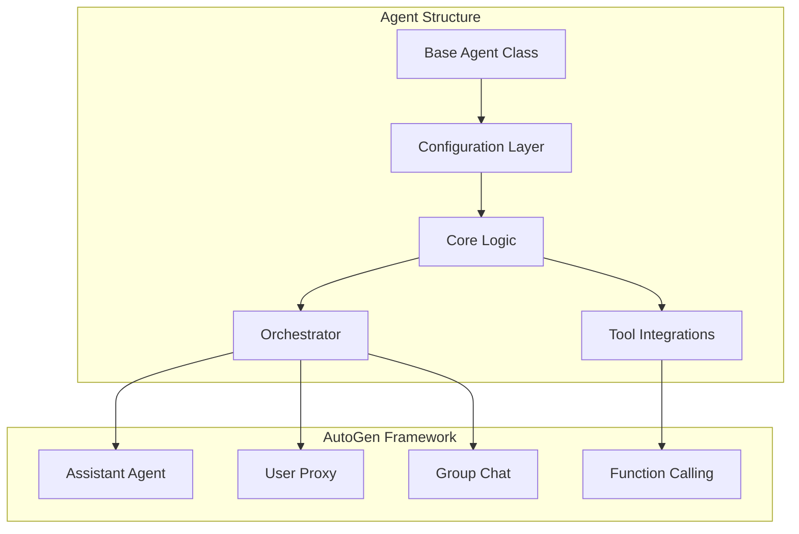

# Agent Documentation

Comprehensive documentation for all implemented AutoGen agents in the Varga AI platform.

## 📚 Available Agents

### Education Agents

#### [AI Language Teacher](./language-teacher/)
A sophisticated AI-powered language learning system featuring:
- 🧠 **Adaptive Learning Engine** - IRT/BKT models for personalized difficulty
- 💬 **Natural Language Processing** - Grammar correction and semantic analysis
- 📊 **Learning Analytics** - Progress tracking and performance forecasting
- 🔄 **Spaced Repetition** - SM-2+ algorithm for optimal retention
- 🤖 **Multi-Agent System** - Coordinated AutoGen agents for teaching

**Status**: ✅ Production Ready | **Telegram Integration**: ✅ Complete

---

### Marketing Agents

#### [Enhanced Image Generator](./image-generator/)
Advanced AutoGen-based image generation with collaborative workflows:
- 🎨 **Multi-Agent Workflows** - Creative director, prompt engineer, quality reviewer
- 🔄 **Workflow Orchestration** - Sequential, parallel, and conditional patterns
- 💭 **Conversation Management** - Sophisticated state transitions
- 🛠️ **AutoGen Patterns** - Group chat, function calling, resilient wrappers
- 📈 **Performance Optimization** - Circuit breakers and retry mechanisms

**Status**: ✅ Production Ready | **DALL-E Integration**: ✅ Complete

---

## 🏗️ Agent Architecture

All agents follow a standardized architecture pattern:



## 📁 Standard Agent Structure

Every agent follows this consistent folder structure:

```
agent_name/
├── agent.py                    # Main agent implementation
├── config.yaml                 # Agent configuration
├── README.md                   # Agent documentation
├── orchestrator.py            # Multi-agent orchestration (if applicable)
├── tools/                     # Agent-specific tools
│   ├── __init__.py
│   └── specific_tool.py
├── prompts/                   # Prompt templates
│   ├── system_prompts.yaml
│   └── user_prompts.yaml
├── models/                    # AI/ML models (if applicable)
│   └── model_definitions.py
└── tests/                     # Test suite
    ├── test_agent.py
    └── test_integration.py
```

## 🚀 Quick Start

### Using an Agent

```python
from agents.categories.education.language_teacher.agent import LanguageTeacherAgent

# Initialize with configuration
config = {
    'target_language': 'english',
    'adaptive_learning': {'enabled': True}
}
agent = LanguageTeacherAgent(config)

# Use the agent
result = await agent.process_request(user_input)
```

### Creating a New Agent

1. **Inherit from BaseAgent**:
```python
from agents.base.base_agent import BaseAgent

class MyNewAgent(BaseAgent):
    def __init__(self, config):
        super().__init__(config)
        # Your initialization
```

2. **Implement Required Methods**:
```python
async def setup(self):
    """Initialize agent resources"""
    pass

async def process_request(self, request):
    """Process user requests"""
    pass
```

3. **Register with Agent Registry**:
```python
from agents.base.agent_registry import AgentRegistry

AgentRegistry.register('my_new_agent', MyNewAgent)
```

## 🔧 Configuration Management

All agents use YAML-based configuration:

```yaml
# config.yaml
agent:
  name: "language_teacher"
  version: "1.0.0"
  description: "AI Language Teacher Agent"

autogen:
  model: "gpt-4"
  temperature: 0.7
  max_tokens: 2000

features:
  adaptive_learning: true
  spaced_repetition: true
  analytics: true

integrations:
  telegram: true
  web_api: true
```

## 🧪 Testing Strategy

Each agent includes comprehensive tests:

- **Unit Tests** - Core functionality
- **Integration Tests** - External service integration
- **Performance Tests** - Response time and throughput
- **Conversation Tests** - Multi-turn dialogue validation

Run tests:
```bash
# All tests for an agent
pytest agents/categories/education/language_teacher/tests/

# Specific test file
pytest agents/categories/education/language_teacher/tests/test_agent.py
```

## 📊 Performance Metrics

Standard metrics tracked for all agents:

| Metric | Target | Measurement |
|--------|--------|-------------|
| Response Time | <2s | p95 latency |
| Success Rate | >95% | Successful/Total |
| Memory Usage | <500MB | Peak usage |
| Token Efficiency | <1000/req | Average tokens |

## 🔐 Security Considerations

All agents implement:

- **Input Validation** - Sanitize user inputs
- **Rate Limiting** - Prevent abuse
- **Token Management** - Secure API key handling
- **Audit Logging** - Track all operations
- **Error Handling** - Graceful failure recovery

## 📚 Agent Categories

### Current Implementation Status

| Category | Implemented | In Progress | Planned |
|----------|------------|-------------|---------|
| **Education** | 1 | 0 | 4 |
| **Marketing** | 1 | 0 | 4 |
| **Sales** | 0 | 0 | 5 |
| **Customer Service** | 1 | 0 | 5 |
| **Operations** | 0 | 0 | 6 |
| **Finance** | 0 | 0 | 6 |

### Development Roadmap

**Phase 1 (Current)**:
- ✅ Language Teacher Agent
- ✅ Image Generator Agent
- ✅ Smart Assistant Agent

**Phase 2 (Q1 2025)**:
- 📋 Lead Qualifier Agent
- 📋 Invoice Processor Agent
- 📋 Ticket Handler Agent

**Phase 3 (Q2 2025)**:
- 📋 Content Creator Agent
- 📋 Workflow Automator Agent
- 📋 Expense Tracker Agent

## 🤝 Contributing

To contribute a new agent:

1. Follow the standard agent structure
2. Implement comprehensive tests
3. Document all features
4. Submit PR with:
   - Agent implementation
   - Configuration template
   - Usage examples
   - Test coverage >80%

## 📖 Additional Resources

- [AutoGen Framework Documentation](https://microsoft.github.io/autogen/)
- [Agent Development Guide](../development/agent-development)
- [Best Practices](../development/best-practices)
- [API Reference](../api/agents)

---

*Building intelligent automation through specialized AI agents* 🤖