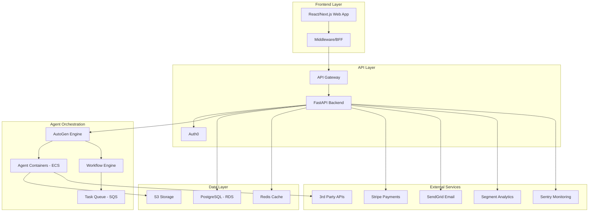
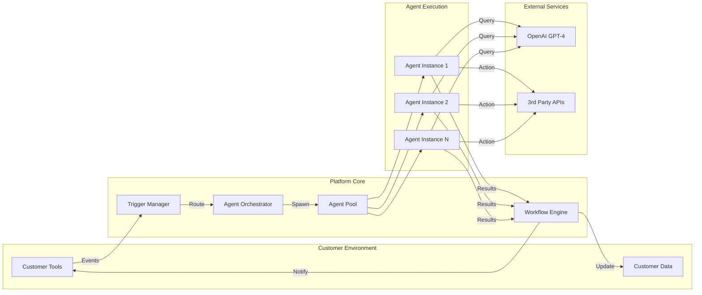
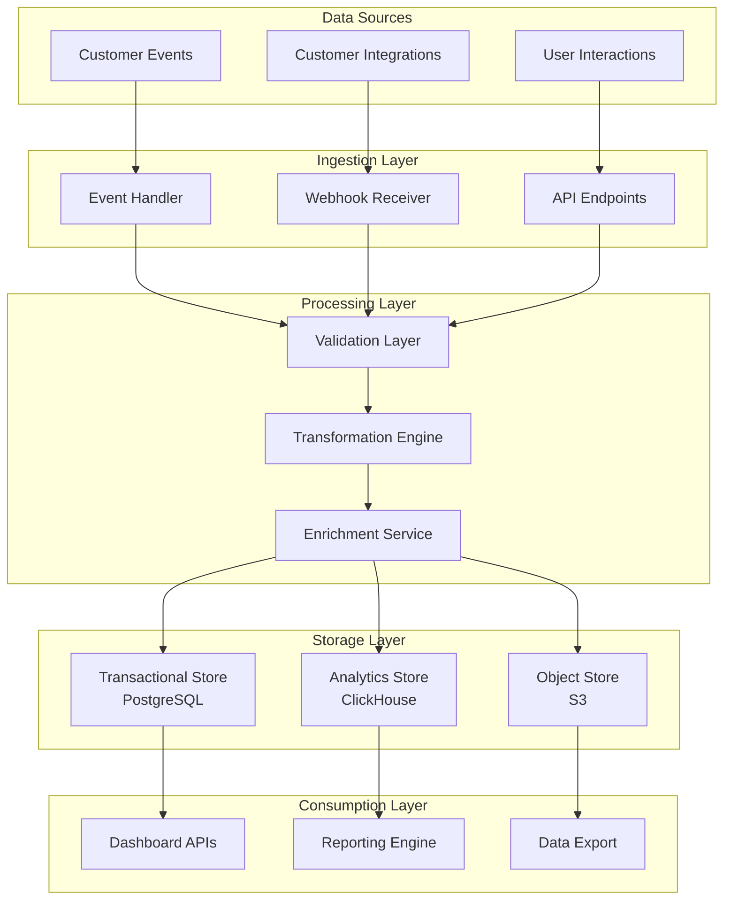

# Architecture

This document outlines the comprehensive system architecture for the Varga AI Platform.

## System Overview

## Technology Stack

### Frontend
- **Framework**: React/Next.js with TypeScript
- **UI Library**: Modern React components
- **State Management**: Context API/Redux Toolkit
- **Styling**: Tailwind CSS/Styled Components

### Backend
- **Framework**: Python with FastAPI
- **Authentication**: Auth0 integration
- **API Gateway**: AWS API Gateway
- **Agent Runtime**: AutoGen in Docker containers

### Data Layer
- **Primary Database**: PostgreSQL (AWS RDS)
- **Caching**: Redis for session and application cache
- **File Storage**: AWS S3 for documents and assets
- **Analytics Storage**: ClickHouse for time-series data

### Infrastructure
- **Cloud Platform**: AWS
- **Container Orchestration**: Amazon ECS
- **Message Queue**: Amazon SQS
- **Monitoring**: CloudWatch, Sentry
- **CI/CD**: GitHub Actions

## Agent Workflow Architecture

## Data Flow Architecture

## Project Structure

The project follows a modular architecture with clear separation of concerns:

```mermaid
graph TD
    ROOT[varga-ai/]
    
    %% Agents Structure
    ROOT --> AGENTS[agents/]
    AGENTS --> CATEGORIES[categories/]
    AGENTS --> BASE_AGENT[base/]
    AGENTS --> SHARED_AGENT[shared/]
    
    CATEGORIES --> SALES[sales/]
    CATEGORIES --> CUSTSERV[customer_service/]
    CATEGORIES --> OPS[operations/]
    CATEGORIES --> FINANCE[finance/]
    CATEGORIES --> MARKETING[marketing/]
    
    %% Tools Structure
    ROOT --> TOOLS[tools/]
    TOOLS --> INTEGRATIONS[integrations/]
    TOOLS --> BASE_TOOL[base/]
    TOOLS --> UTILITIES[utilities/]
    
    INTEGRATIONS --> GOOGLE[google/]
    INTEGRATIONS --> MICROSOFT[microsoft/]
    INTEGRATIONS --> CRM[crm/]
    INTEGRATIONS --> ACCOUNTING[accounting/]
    INTEGRATIONS --> COMM[communication/]
    
    %% Platform Structure
    ROOT --> PLATFORM[platform/]
    PLATFORM --> API[api/]
    PLATFORM --> CORE[core/]
    PLATFORM --> FRONTEND[frontend/]
    PLATFORM --> SHARED_PLAT[shared/]
    
    %% Workflows Structure
    ROOT --> WORKFLOWS[workflows/]
    WORKFLOWS --> TEMPLATES[templates/]
    WORKFLOWS --> ENGINE[engine/]
    WORKFLOWS --> BUILDER[builder/]
    
    %% Other Structures
    ROOT --> CONFIG[config/]
    ROOT --> GUTENBERG[gutenberg/]
    ROOT --> TESTS[tests/]
    ROOT --> SCRIPTS[scripts/]
```

## Key Architectural Decisions

### 1. Multi-Tenant Architecture
- **Schema-based Isolation**: Each tenant has isolated database schemas
- **Resource Isolation**: Separate containers per tenant for heavy workloads
- **Data Segregation**: Tenant ID propagated through all layers
- **Security**: Row-level security policies in PostgreSQL

### 2. Event-Driven Architecture
- **Message Queue**: SQS for reliable message delivery
- **Event Sourcing**: Track all significant events
- **Async Processing**: Non-blocking operations for better performance
- **Webhook Integration**: Real-time updates to customer systems

### 3. Microservices Design
- **Service Boundaries**: Clear functional boundaries
- **API First**: Well-defined interfaces between services
- **Independent Deployment**: Services can be deployed independently
- **Fault Isolation**: Failure in one service doesn't affect others

### 4. Containerized Agents
- **Isolation**: Each agent runs in its own container
- **Scalability**: Auto-scaling based on demand
- **Resource Management**: CPU and memory limits per agent
- **Security**: Sandboxed execution environment

## Security Architecture

### Authentication & Authorization
- **OAuth 2.0**: Industry-standard authentication
- **JWT Tokens**: Stateless authentication tokens
- **Role-Based Access Control**: Granular permission system
- **API Key Management**: Secure storage and rotation

### Data Security
- **Encryption at Rest**: All data encrypted in storage
- **Encryption in Transit**: TLS 1.3 for all communications
- **Secret Management**: AWS Secrets Manager for sensitive data
- **Audit Logging**: Comprehensive audit trail

### Network Security
- **VPC**: Isolated network environment
- **Security Groups**: Restrictive firewall rules
- **WAF**: Web Application Firewall protection
- **DDoS Protection**: CloudFlare integration

## Scalability Considerations

### Horizontal Scaling
- **Load Balancing**: Application Load Balancer
- **Auto Scaling**: Based on CPU, memory, and custom metrics
- **Database Scaling**: Read replicas and connection pooling
- **CDN**: CloudFront for static content delivery

### Performance Optimization
- **Caching Strategy**: Multi-level caching (Redis, CDN, application)
- **Database Optimization**: Proper indexing and query optimization
- **Connection Pooling**: Efficient database connection management
- **Async Processing**: Non-blocking I/O operations

### Monitoring & Observability
- **Metrics**: CloudWatch for system metrics
- **Logging**: Structured logging with correlation IDs
- **Tracing**: Distributed tracing for request flows
- **Alerting**: Proactive monitoring and alerting

## High Availability & Disaster Recovery

### Availability Design
- **Multi-AZ Deployment**: Services distributed across availability zones
- **Health Checks**: Automated health monitoring
- **Failover**: Automatic failover for critical components
- **Circuit Breakers**: Prevent cascade failures

### Backup & Recovery
- **Database Backups**: Automated daily backups with point-in-time recovery
- **File Storage**: Cross-region replication for S3
- **Configuration Backup**: Infrastructure as Code in version control
- **Recovery Testing**: Regular disaster recovery drills

## Development & Deployment

### CI/CD Pipeline
- **Source Control**: GitHub with branch protection
- **Automated Testing**: Unit, integration, and e2e tests
- **Security Scanning**: Automated security vulnerability scanning
- **Deployment**: Blue-green deployments with rollback capability

### Environment Management
- **Environment Parity**: Development, staging, and production consistency
- **Configuration Management**: Environment-specific configuration
- **Feature Flags**: Controlled feature rollouts
- **Monitoring**: Comprehensive monitoring across all environments

## Compliance & Governance

### Data Compliance
- **GDPR Compliance**: Data protection and privacy rights
- **SOC 2**: Security and availability controls
- **Data Retention**: Configurable data retention policies
- **Right to Delete**: Automated data deletion capabilities

### Operational Governance
- **Change Management**: Structured change approval process
- **Documentation**: Comprehensive system documentation
- **Incident Response**: Defined incident response procedures
- **Business Continuity**: Disaster recovery and business continuity planning