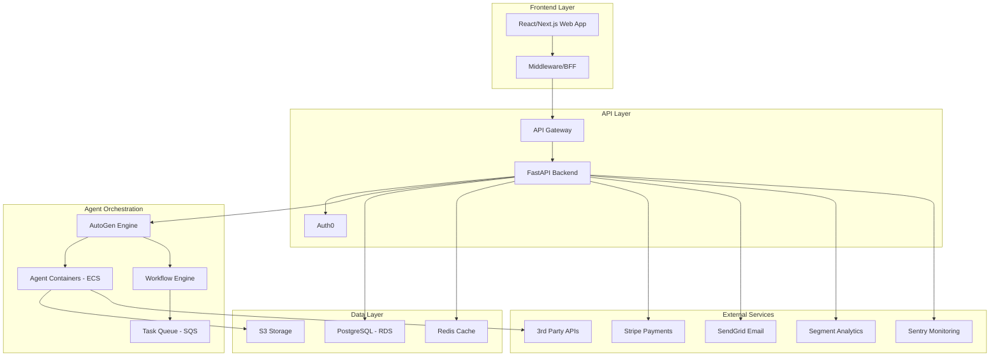

# System Architecture Overview

The Varga AI platform follows a modern, scalable, multi-tenant architecture designed to handle thousands of concurrent SME users and their automation workflows.

## High-Level Architecture



## Core Components

### 1. Agent Orchestration System
- **AutoGen Engine**: Core framework for multi-agent conversations
- **Agent Containers**: Isolated execution environments for agents
- **Workflow Engine**: Orchestrates complex multi-step processes
- **Task Queue**: Manages asynchronous agent tasks

### 2. Tool Framework
- **Base Tools**: Generic tools (web search, text generation, chatbot)
- **Integration Tools**: SME tool connectors (Gmail, Slack, QuickBooks)
- **Utility Services**: Rate limiting, error handling, logging

### 3. Multi-Tenant Platform
- **Tenant Isolation**: Schema-based data separation
- **Resource Management**: Per-tenant quotas and limits
- **Configuration**: Tenant-specific settings and customizations

## Key Architectural Decisions

### Technology Stack
- **Backend**: Python 3.12+ with FastAPI and AutoGen
- **Database**: PostgreSQL with Redis for caching
- **Infrastructure**: AWS (ECS, RDS, S3, CloudWatch)
- **Frontend**: React/Next.js with TypeScript
- **Documentation**: Docusaurus 3.8.1

### Design Principles
1. **Microservices Architecture**: Modular, independently deployable services
2. **Event-Driven Design**: Async communication between components
3. **Multi-Tenancy**: Secure isolation between customers
4. **API-First**: All functionality exposed via REST APIs
5. **Containerization**: Docker containers for consistent deployment

### Scalability Features
- **Horizontal Scaling**: Auto-scaling agent containers
- **Caching Strategy**: Multi-layer caching with Redis
- **Queue-Based Processing**: Asynchronous task handling
- **Load Balancing**: Distributed request handling

## Security Architecture

### Authentication & Authorization
- **OAuth2/SSO**: Auth0 integration
- **Role-Based Access Control**: Granular permissions
- **API Security**: Token-based authentication
- **Tenant Isolation**: Secure data separation

### Data Protection
- **Encryption**: TLS 1.3 for data in transit
- **Database Security**: Encrypted at rest
- **API Keys**: Secure credential management
- **Audit Logging**: Comprehensive activity tracking

## Performance Requirements

- **API Response Time**: &lt;2 seconds
- **Concurrent Users**: 5,000 simultaneous users
- **Daily Tasks**: 500K agent tasks processed
- **Uptime**: 99.9% availability SLA
- **Scalability**: 10x growth without architecture changes

## Monitoring & Observability

### Logging
- **Structured Logging**: JSON-formatted logs with correlation IDs
- **Centralized Collection**: CloudWatch for log aggregation
- **Multi-Level Logging**: DEBUG, INFO, WARNING, ERROR levels
- **Tenant Context**: All logs include tenant identification

### Metrics & Monitoring
- **Application Metrics**: Performance and usage statistics
- **Infrastructure Metrics**: Resource utilization tracking
- **Business Metrics**: Agent success rates, user engagement
- **Error Tracking**: Sentry integration for error monitoring

### Health Checks
- **Service Health**: Individual component status checks
- **Dependency Monitoring**: External service availability
- **Database Health**: Connection and performance monitoring
- **Agent Performance**: Execution time and success rates

## Development Workflow

### Code Organization
```
src/
├── agents/          # AutoGen agent implementations
├── tools/           # Tool framework and implementations
├── config/          # Configuration management
├── log_service/     # Centralized logging
└── platform/       # Core platform services
```

### Development Practices
- **1 File = 1 Class**: Maximum 400 lines per file
- **Type Safety**: Comprehensive type hints and validation
- **Async/Await**: Modern Python async patterns
- **Error Handling**: Structured error management
- **Testing**: Unit, integration, and E2E testing