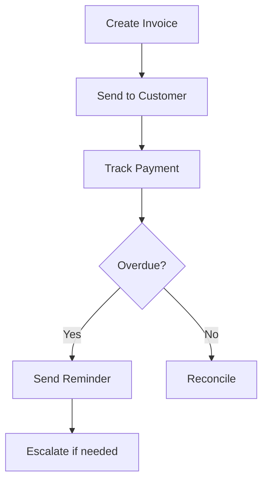

# AI Agent Catalog

Comprehensive catalog of pre-built AutoGen agents designed for SME automation across five key business categories.

## 📊 Agent Overview

Our platform offers **25-30 production-ready agents** organized into five main categories:

```mermaid
graph TB
    ROOT[Agent Library]
    
    ROOT --> SALES[Sales Automation<br/>5 Agents]
    ROOT --> CS[Customer Service<br/>6 Agents]
    ROOT --> OPS[Operations<br/>6 Agents]
    ROOT --> FIN[Finance<br/>6 Agents]
    ROOT --> MKT[Marketing<br/>5 Agents]
    
    SALES --> S1[Lead Qualifier]
    SALES --> S2[Appointment Scheduler]
    SALES --> S3[Quote Generator]
    SALES --> S4[Follow-up Manager]
    SALES --> S5[Pipeline Tracker]
    
    CS --> C1[Ticket Handler]
    CS --> C2[FAQ Responder]
    CS --> C3[Escalation Manager]
    CS --> C4[Feedback Collector]
    CS --> C5[Chat Support]
    CS --> C6[Email Responder]
    
    OPS --> O1[Inventory Tracker]
    OPS --> O2[Order Processor]
    OPS --> O3[Workflow Automator]
    OPS --> O4[Task Scheduler]
    OPS --> O5[Quality Monitor]
    OPS --> O6[Resource Planner]
```



## 💼 Sales Automation Agents

### 1. Lead Qualifier Agent
**Purpose**: Automatically qualify incoming leads based on predefined criteria

**Features**:
- Score leads based on engagement and fit
- Enrich lead data from multiple sources
- Route qualified leads to sales team
- Track lead source effectiveness

**Configuration**:
```yaml
agent: lead_qualifier
config:
  scoring_criteria:
    - company_size: 10-500
    - budget: >$10000
    - timeline: <3_months
  data_sources:
    - linkedin
    - clearbit
    - website_activity
  routing_rules:
    hot_leads: senior_sales
    warm_leads: junior_sales
    cold_leads: nurture_campaign
```

**ROI Impact**: 40% reduction in sales qualification time

---

### 2. Appointment Scheduler Agent
**Purpose**: Manage calendar scheduling and meeting coordination

**Features**:
- Calendar availability checking
- Time zone management
- Automated reminders
- Rescheduling handling
- Meeting prep materials

**Integrations**:
- Google Calendar
- Microsoft Outlook
- Calendly
- Zoom/Teams

**Use Cases**:
- Sales demos
- Customer onboarding
- Support calls
- Consultation sessions

---

### 3. Quote Generator Agent
**Purpose**: Create and send customized quotes automatically

**Features**:
- Dynamic pricing calculation
- Product/service configuration
- Discount application
- PDF generation
- E-signature integration

**Business Rules**:
```python
class QuoteRules:
    volume_discounts = {
        10: 5,   # 5% off for 10+ items
        50: 10,  # 10% off for 50+ items
        100: 15  # 15% off for 100+ items
    }
    
    approval_required = lambda total: total > 50000
    expiry_days = 30
```

---

### 4. Follow-up Manager Agent
**Purpose**: Ensure timely follow-ups with prospects and customers

**Features**:
- Automated follow-up sequences
- Personalized messaging
- Response tracking
- A/B testing capabilities
- Engagement analytics

---

### 5. Pipeline Tracker Agent
**Purpose**: Monitor and optimize sales pipeline

**Features**:
- Deal stage tracking
- Forecast generation
- Bottleneck identification
- Win/loss analysis
- Performance metrics

## 🎧 Customer Service Agents

### 1. Ticket Handler Agent
**Purpose**: Automate ticket creation, routing, and initial response

**Capabilities**:
- Automatic ticket categorization
- Priority assignment
- SLA monitoring
- Escalation triggers
- Resolution tracking

**Workflow**:


---

### 2. FAQ Responder Agent
**Purpose**: Instantly answer common customer questions

**Features**:
- Natural language understanding
- Knowledge base integration
- Multi-language support
- Confidence scoring
- Fallback to human

**Knowledge Base Structure**:
```json
{
  "categories": [
    {
      "name": "Billing",
      "questions": [
        {
          "q": "How do I update payment method?",
          "a": "Go to Settings > Billing > Payment Methods...",
          "confidence": 0.95
        }
      ]
    }
  ]
}
```

---

### 3. Escalation Manager Agent
**Purpose**: Handle and route complex customer issues

**Features**:
- Sentiment analysis
- Issue severity assessment
- Expert routing
- Priority queuing
- Executive escalation

---

### 4. Feedback Collector Agent
**Purpose**: Gather and analyze customer feedback

**Features**:
- Survey deployment
- NPS calculation
- Sentiment analysis
- Trend identification
- Action item generation

---

### 5. Chat Support Agent
**Purpose**: Provide real-time chat assistance

**Features**:
- 24/7 availability
- Context awareness
- Multi-channel support
- Typing indicators
- File sharing

---

### 6. Email Responder Agent
**Purpose**: Manage and respond to customer emails

**Features**:
- Auto-categorization
- Template responses
- Personalization
- Attachment handling
- Thread management

## ⚙️ Operations Agents

### 1. Inventory Tracker Agent
**Purpose**: Monitor and manage inventory levels

**Capabilities**:
- Real-time stock monitoring
- Reorder point alerts
- Demand forecasting
- Supplier coordination
- Inventory optimization

**Metrics Tracked**:
- Stock levels
- Turnover rate
- Carrying costs
- Stockout frequency
- Lead times

---

### 2. Order Processor Agent
**Purpose**: Automate order fulfillment workflow

**Workflow Steps**:
1. Order validation
2. Inventory check
3. Payment processing
4. Fulfillment initiation
5. Shipping coordination
6. Tracking updates

---

### 3. Workflow Automator Agent
**Purpose**: Create and manage business process automation

**Features**:
- Visual workflow designer
- Conditional logic
- Multi-step processes
- Error handling
- Performance monitoring

**Example Workflow**:
```yaml
name: new_employee_onboarding
triggers:
  - type: form_submission
    source: hr_system
steps:
  - create_accounts:
      systems: [email, slack, github]
  - assign_equipment:
      items: [laptop, phone, access_card]
  - schedule_training:
      sessions: [orientation, role_specific]
  - notify_team:
      channels: [email, slack]
```

---

### 4. Task Scheduler Agent
**Purpose**: Optimize task assignment and scheduling

**Features**:
- Resource availability checking
- Priority-based scheduling
- Deadline management
- Conflict resolution
- Load balancing

---

### 5. Quality Monitor Agent
**Purpose**: Track and ensure quality standards

**Monitoring Areas**:
- Process compliance
- Output quality
- Error rates
- Customer satisfaction
- Performance metrics

---

### 6. Resource Planner Agent
**Purpose**: Optimize resource allocation

**Features**:
- Capacity planning
- Utilization tracking
- Skill matching
- Cost optimization
- Forecast modeling

## 💰 Finance Agents

### 1. Invoice Processor Agent
**Purpose**: Automate invoice creation and processing

**Capabilities**:
- Invoice generation
- Payment tracking
- Overdue reminders
- Reconciliation
- Tax calculation

**Invoice Workflow**:


---

### 2. Expense Tracker Agent
**Purpose**: Monitor and categorize business expenses

**Features**:
- Receipt scanning (OCR)
- Category assignment
- Budget monitoring
- Approval workflows
- Report generation

---

### 3. Payment Reminder Agent
**Purpose**: Manage payment collection

**Features**:
- Automated reminders
- Payment scheduling
- Late fee calculation
- Payment plan management
- Collection escalation

---

### 4. Budget Monitor Agent
**Purpose**: Track budget vs actual spending

**Monitoring**:
- Real-time spend tracking
- Variance analysis
- Alert thresholds
- Forecast adjustments
- Department budgets

---

### 5. Financial Reporter Agent
**Purpose**: Generate financial reports and insights

**Reports Generated**:
- P&L statements
- Cash flow reports
- Budget variance
- Financial KPIs
- Custom reports

---

### 6. Tax Compliance Agent
**Purpose**: Ensure tax compliance and preparation

**Features**:
- Tax calculation
- Filing reminders
- Document collection
- Compliance checking
- Audit preparation

## 📣 Marketing Agents

### 1. Content Creator Agent
**Purpose**: Generate marketing content

**Content Types**:
- Blog posts
- Social media posts
- Email newsletters
- Product descriptions
- Landing page copy

**Customization**:
```python
content_config = {
    "tone": "professional",
    "style": "conversational",
    "length": "medium",
    "keywords": ["automation", "efficiency"],
    "cta": "Sign up for free trial"
}
```

---

### 2. Social Media Scheduler Agent
**Purpose**: Manage social media presence

**Features**:
- Multi-platform posting
- Optimal timing
- Hashtag suggestions
- Engagement tracking
- Content calendar

**Supported Platforms**:
- LinkedIn
- Twitter/X
- Facebook
- Instagram
- TikTok

---

### 3. Email Campaign Manager Agent
**Purpose**: Execute email marketing campaigns

**Campaign Features**:
- List segmentation
- A/B testing
- Personalization
- Drip campaigns
- Analytics tracking

---

### 4. SEO Optimizer Agent
**Purpose**: Improve search engine visibility

**Optimization Areas**:
- Keyword research
- Content optimization
- Meta tag generation
- Site structure analysis
- Backlink monitoring

---

### 5. Analytics Reporter Agent
**Purpose**: Track and report marketing metrics

**Metrics Tracked**:
- Website traffic
- Conversion rates
- Campaign ROI
- Customer acquisition cost
- Engagement metrics

## 🔧 Agent Configuration

### Standard Configuration Options

Every agent supports these base configurations:

```yaml
base_config:
  enabled: true
  schedule: "0 9 * * *"  # Daily at 9 AM
  retry_policy:
    max_attempts: 3
    backoff: exponential
  notifications:
    success: email
    failure: [email, slack]
  rate_limits:
    requests_per_minute: 60
    concurrent_tasks: 5
  logging:
    level: INFO
    retention_days: 30
```

### Agent Deployment Process

1. **Selection** - Choose from marketplace
2. **Configuration** - Set parameters
3. **Integration** - Connect tools
4. **Testing** - Validate setup
5. **Activation** - Deploy to production
6. **Monitoring** - Track performance

## 📈 Performance Metrics

### Agent Effectiveness KPIs

| Metric | Target | Measurement |
|--------|--------|-------------|
| Task Success Rate | >95% | Completed/Total |
| Processing Time | <30s | Average duration |
| Error Rate | <2% | Errors/Total |
| User Satisfaction | >4.5/5 | Survey scores |
| Cost Savings | >50% | Manual vs Automated |

## 🚀 Getting Started with Agents

### Quick Start Guide

1. **Browse Catalog** - Review available agents
2. **Select Agents** - Choose based on needs
3. **Configure** - Set up parameters
4. **Integrate** - Connect your tools
5. **Test** - Run in sandbox
6. **Deploy** - Activate in production
7. **Monitor** - Track performance

### Best Practices

- Start with 2-3 agents
- Test thoroughly before production
- Monitor performance regularly
- Iterate on configurations
- Scale gradually

---

*Empowering SMEs with intelligent automation, one agent at a time.* 🤖