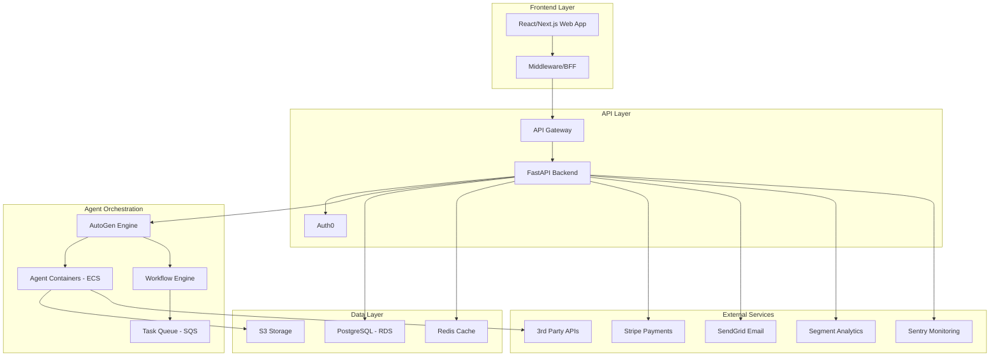
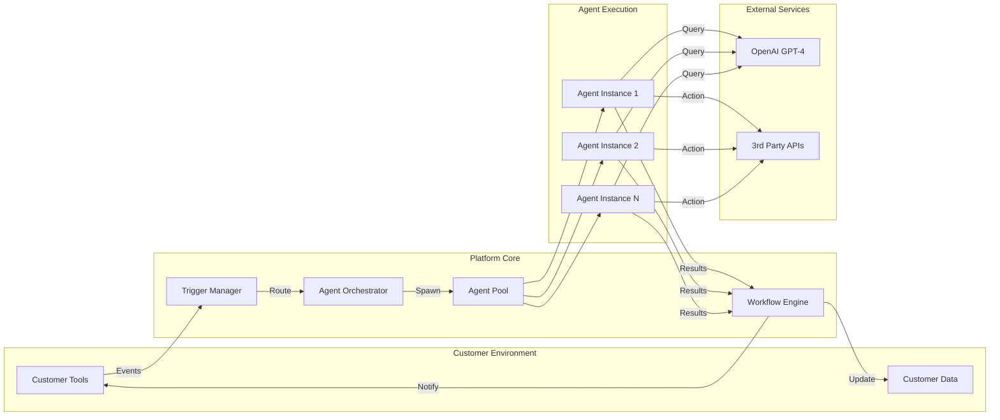
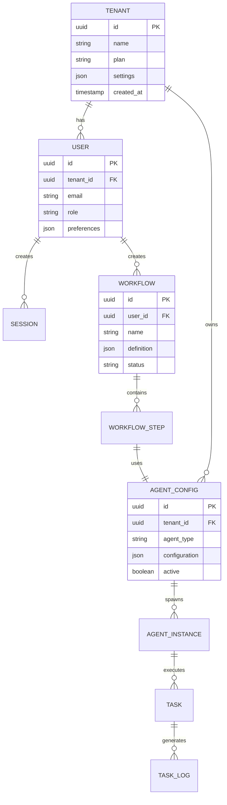
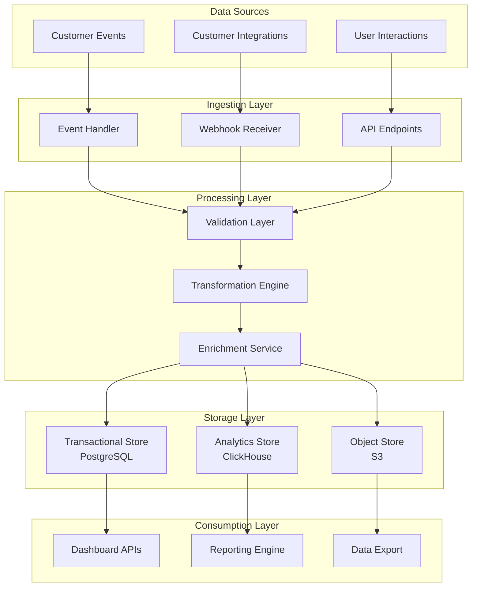
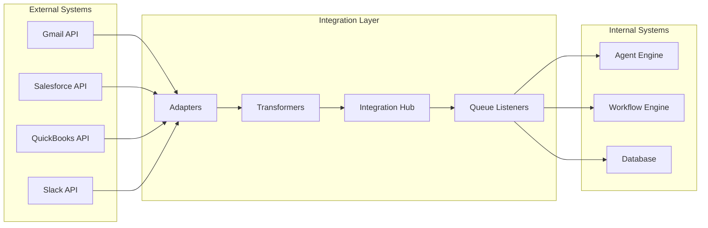
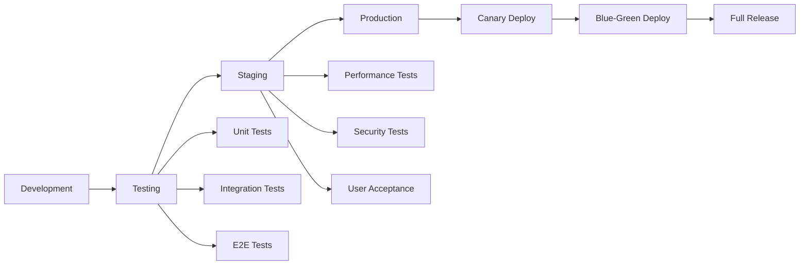

# Technical Architecture

Comprehensive technical design and architecture of the AutoGen-based SaaS platform for SME automation.

## 🏗️ System Architecture Overview



## 💻 Technology Stack

### Frontend Technologies
- **Framework**: React 18 with Next.js 14
- **Language**: TypeScript 5.0+
- **Styling**: Tailwind CSS + Shadcn/ui
- **State Management**: Zustand + React Query
- **Testing**: Jest + React Testing Library
- **Build Tools**: Webpack 5, SWC

### Backend Technologies
- **Framework**: FastAPI (Python 3.12+)
- **ORM**: SQLAlchemy 2.0
- **Task Queue**: Celery + Redis
- **API Docs**: OpenAPI/Swagger
- **Testing**: Pytest + Coverage
- **Validation**: Pydantic v2

### Infrastructure Stack
- **Cloud Provider**: AWS
- **Container Orchestration**: ECS Fargate
- **Database**: RDS PostgreSQL 15
- **Cache**: ElastiCache Redis 7
- **Storage**: S3 + CloudFront CDN
- **Monitoring**: CloudWatch + Sentry

### AI/ML Stack
- **Agent Framework**: Microsoft AutoGen
- **LLM Provider**: OpenAI GPT-4
- **Vector Database**: Pinecone
- **ML Ops**: MLflow + Weights & Biases
- **Model Serving**: SageMaker

## 🔄 Agent Workflow Architecture



## 🗄️ Data Architecture

### Database Schema Design



### Data Flow Architecture



## 🏢 Multi-Tenancy Architecture

### Isolation Strategy
- **Database**: Schema-based isolation
- **Storage**: Tenant-specific S3 buckets
- **Compute**: Container-level isolation
- **Network**: VPC per tier, security groups

### Tenant Management
```python
class TenantManager:
    """Multi-tenant management system"""
    
    def create_tenant(self, tenant_data):
        # Create schema
        # Initialize storage
        # Set up permissions
        # Configure limits
        pass
    
    def isolate_context(self, tenant_id):
        # Set database schema
        # Configure S3 context
        # Apply rate limits
        # Set resource quotas
        pass
```

## 🔐 Security Architecture

### Security Layers

1. **Network Security**
   - AWS WAF for DDoS protection
   - CloudFront for edge security
   - VPC with private subnets
   - Security groups and NACLs

2. **Application Security**
   - OAuth2/OIDC via Auth0
   - API key management
   - Rate limiting per tenant
   - Input validation and sanitization

3. **Data Security**
   - Encryption at rest (AES-256)
   - Encryption in transit (TLS 1.3)
   - Database encryption
   - S3 bucket encryption

4. **Compliance**
   - SOC2 Type II controls
   - GDPR data handling
   - Audit logging
   - Data retention policies

## 📊 Performance Architecture

### Scalability Design

```yaml
# Horizontal Scaling Configuration
services:
  api:
    min_instances: 2
    max_instances: 50
    target_cpu: 70%
    target_memory: 80%
    
  agents:
    min_instances: 5
    max_instances: 100
    scale_on_queue_depth: 10
    
  workers:
    min_instances: 3
    max_instances: 20
    autoscale_on_tasks: true
```

### Caching Strategy

| Layer | Technology | TTL | Use Case |
|-------|------------|-----|----------|
| CDN | CloudFront | 24h | Static assets |
| API | Redis | 5m | Session data |
| Database | Redis | 1h | Query results |
| Application | In-memory | 10m | Configuration |

### Performance Targets

- **API Response Time**: <200ms (p95)
- **Agent Spawn Time**: <2s
- **Task Processing**: <5s (simple), <30s (complex)
- **Dashboard Load**: <1s
- **Concurrent Users**: 5,000+
- **Tasks/Day**: 500,000+

## 🔄 Integration Architecture

### Integration Patterns



### Supported Integrations

| Category | Services | Method |
|----------|----------|--------|
| **Email** | Gmail, Outlook | OAuth2 + API |
| **CRM** | Salesforce, HubSpot | REST API |
| **Accounting** | QuickBooks, Xero | OAuth2 + API |
| **Communication** | Slack, Teams | Webhooks |
| **Storage** | Google Drive, OneDrive | OAuth2 + API |
| **E-commerce** | Shopify, WooCommerce | REST API |

## 🚀 Deployment Architecture

### CI/CD Pipeline



### Infrastructure as Code

```hcl
# Terraform configuration example
resource "aws_ecs_service" "agent_service" {
  name            = "agent-service"
  cluster         = aws_ecs_cluster.main.id
  task_definition = aws_ecs_task_definition.agent.arn
  desired_count   = var.agent_count
  
  deployment_configuration {
    maximum_percent         = 200
    minimum_healthy_percent = 100
  }
  
  auto_scaling {
    min_capacity = 5
    max_capacity = 100
  }
}
```

## 📈 Monitoring & Observability

### Monitoring Stack

- **Metrics**: CloudWatch + Prometheus
- **Logging**: CloudWatch Logs + ELK Stack
- **Tracing**: AWS X-Ray + Jaeger
- **APM**: New Relic / DataDog
- **Alerting**: PagerDuty + Slack

### Key Metrics

```yaml
metrics:
  business:
    - active_tenants
    - tasks_processed
    - agent_utilization
    - revenue_per_tenant
    
  technical:
    - api_latency_p95
    - error_rate
    - database_connections
    - queue_depth
    
  infrastructure:
    - cpu_utilization
    - memory_usage
    - disk_iops
    - network_throughput
```

## 🔧 Development Architecture

### Microservices Structure

```
platform/
├── services/
│   ├── api-gateway/
│   ├── auth-service/
│   ├── agent-service/
│   ├── workflow-service/
│   ├── billing-service/
│   └── notification-service/
├── libraries/
│   ├── common/
│   ├── database/
│   └── messaging/
└── infrastructure/
    ├── terraform/
    ├── kubernetes/
    └── docker/
```

### API Design Principles

1. **RESTful Design** - Resource-based URLs
2. **Versioning** - URL path versioning (/v1/)
3. **Pagination** - Cursor-based pagination
4. **Rate Limiting** - Token bucket algorithm
5. **Caching** - ETags and conditional requests
6. **HATEOAS** - Hypermedia links

## 🎯 Architecture Decisions

### Key Design Choices

| Decision | Choice | Rationale |
|----------|--------|-----------|
| **Multi-tenancy** | Schema-based | Balance of isolation and efficiency |
| **Agent Runtime** | Containers | Isolation and scalability |
| **State Management** | Event Sourcing | Audit trail and replay capability |
| **API Style** | REST + GraphQL | Flexibility for different clients |
| **Database** | PostgreSQL | ACID compliance and JSON support |
| **Queue** | SQS + Redis | Reliability and performance |

### Future Considerations

- **Kubernetes Migration** - For better orchestration
- **Service Mesh** - Istio for microservices communication
- **Edge Computing** - CloudFlare Workers for global distribution
- **ML Pipeline** - Kubeflow for ML operations
- **Event Streaming** - Kafka for real-time processing

---

*Building a scalable, secure, and performant platform for the future of SME automation.* 🚀