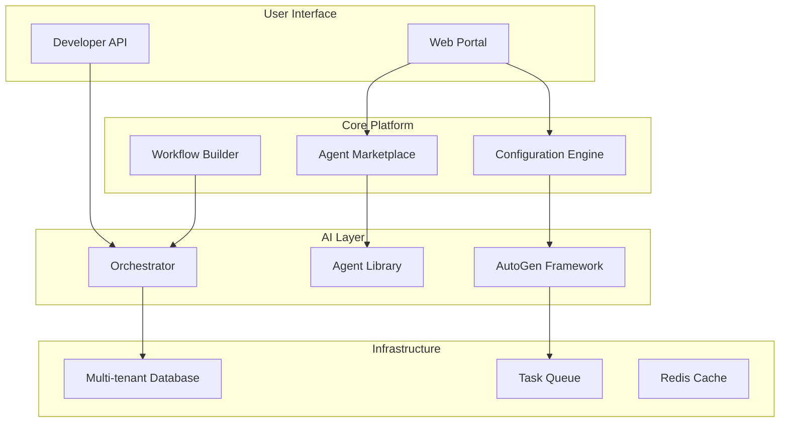

# AutoGen-Based SaaS Platform for SME Automation

A comprehensive platform democratizing AI automation for Small and Medium Enterprises through pre-built, configurable AI agents powered by Microsoft's AutoGen framework.

## 🎯 Vision

Create a SaaS platform that empowers SMEs with enterprise-grade AI automation capabilities without requiring technical expertise or significant IT investment.

## 🚀 Executive Summary

This platform addresses the critical automation gap in the SME market by providing:

- **25-30 Pre-built AI Agents** across 5 business categories
- **No-code Configuration** for easy agent deployment
- **Seamless Integrations** with popular business tools
- **Visual Workflow Builder** for complex automation
- **Usage-based Pricing** for cost efficiency

## 📊 Market Opportunity

### Target Market
- **Primary**: SMEs with 10-500 employees
- **Industries**: Retail, Professional Services, Healthcare, Manufacturing
- **Geography**: Initially US/EU markets
- **TAM**: $50B+ automation market

### Key Problems We Solve

| Problem | Our Solution |
|---------|--------------|
| Limited IT resources | Pre-built, ready-to-use agents |
| High automation costs | Pay-per-use pricing model |
| Complex integrations | One-click connections |
| Lack of AI expertise | No-code configuration |
| Budget constraints | Affordable subscription tiers |

## 🏗️ Platform Architecture

## 📦 Core Components

### 1. Agent Marketplace
Browse and deploy pre-built agents for common business tasks:
- **Sales Automation** - Lead qualification, appointment scheduling
- **Customer Service** - Ticket handling, FAQ responses
- **Operations** - Inventory tracking, order processing
- **Finance** - Invoice processing, expense tracking
- **Marketing** - Content creation, social media management

### 2. Configuration Center
Customize agents without coding:
- Visual configuration forms
- Guided setup wizards
- Business rule editor
- Template library

### 3. Workflow Orchestration
Build complex multi-agent workflows:
- Drag-and-drop interface
- Pre-built workflow templates
- Conditional logic
- Trigger management

### 4. Integration Hub
Connect with existing tools:
- Google Workspace & Microsoft 365
- CRM systems (Salesforce, HubSpot)
- Accounting software (QuickBooks, Xero)
- Communication platforms (Slack, Teams)

### 5. Analytics Dashboard
Monitor and optimize performance:
- Real-time metrics
- ROI calculator
- Agent performance tracking
- Usage analytics

## 🎯 Success Metrics

### Year 1 Goals
- **Customers**: 1,000 SME signups
- **Revenue**: $500K ARR
- **Agents**: 25-30 production-ready
- **Integrations**: 15+ popular tools
- **NPS Score**: >50

### Key Performance Indicators
- Customer acquisition cost (CAC) < $500
- Monthly recurring revenue (MRR) growth >20%
- Agent utilization rate >60%
- Customer retention >85%

## 🚦 Implementation Roadmap

### Phase 1: Foundation (Months 1-3)
- ✅ Core platform architecture
- ✅ Base AutoGen integration
- ✅ Authentication & multi-tenancy
- ✅ Basic agent framework

### Phase 2: MVP (Months 4-6)
- 🔄 10 essential agents
- 🔄 Agent marketplace
- 🔄 Configuration interface
- 🔄 Core integrations

### Phase 3: Beta Launch (Months 7-9)
- 📋 Complete agent library (25-30)
- 📋 Workflow builder
- 📋 Analytics dashboard
- 📋 Customer onboarding

### Phase 4: Production (Months 10-12)
- 📋 Scale infrastructure
- 📋 Advanced features
- 📋 Enterprise capabilities
- 📋 Market launch

## 🏢 Business Model

### Pricing Tiers

| Tier | Price | Features | Target |
|------|-------|----------|--------|
| **Starter** | $99/mo | 3 agents, 1K tasks | Small businesses |
| **Professional** | $299/mo | 10 agents, 10K tasks | Growing SMEs |
| **Business** | $799/mo | Unlimited agents, 50K tasks | Established SMEs |
| **Enterprise** | Custom | Custom limits, SLA | Large organizations |

### Revenue Streams
1. **Subscription Revenue** - Monthly/annual plans
2. **Usage Overage** - Pay-per-task above limits
3. **Professional Services** - Custom agent development
4. **Marketplace Commission** - Third-party agents

## 🔒 Security & Compliance

### Security Features
- End-to-end encryption (TLS 1.3)
- Multi-factor authentication
- Role-based access control
- API rate limiting
- DDoS protection

### Compliance Standards
- SOC2 Type II
- GDPR compliant
- CCPA ready
- HIPAA capable (future)
- ISO 27001 (planned)

## 🌟 Competitive Advantages

1. **Pre-built Agents** - Immediate value, no development needed
2. **AutoGen Power** - Microsoft-backed framework
3. **SME Focus** - Tailored for small business needs
4. **Simple Pricing** - Transparent, usage-based model
5. **Quick Deployment** - Minutes to value, not months

## 📚 Documentation Structure

Explore detailed documentation:

- **[Architecture](./architecture/)** - Technical design and system architecture
- **[Agent Catalog](./agents/)** - Complete agent library and specifications
- **[Implementation](./implementation/)** - Development roadmap and deliverables
- **[Business Strategy](./business/)** - Market analysis and go-to-market plan

## 🤝 Stakeholder Benefits

### For SME Employees
- Automate repetitive tasks
- Focus on strategic work
- Reduce errors
- Improve productivity

### For Business Owners
- Reduce operational costs
- Scale without hiring
- Improve customer satisfaction
- Data-driven insights

### For IT Teams
- No infrastructure management
- Easy integration
- Minimal maintenance
- Enterprise-grade security

## 🚀 Get Started

Ready to revolutionize your SME automation journey?

1. **[Review Architecture](./architecture/)** - Understand the technical foundation
2. **[Explore Agents](./agents/)** - Browse available automation agents
3. **[Check Implementation](./implementation/)** - See development progress
4. **[Contact Sales](mailto:sales@varga-ai.com)** - Start your automation journey

---

*Building the future of SME automation, one agent at a time.* 🤖