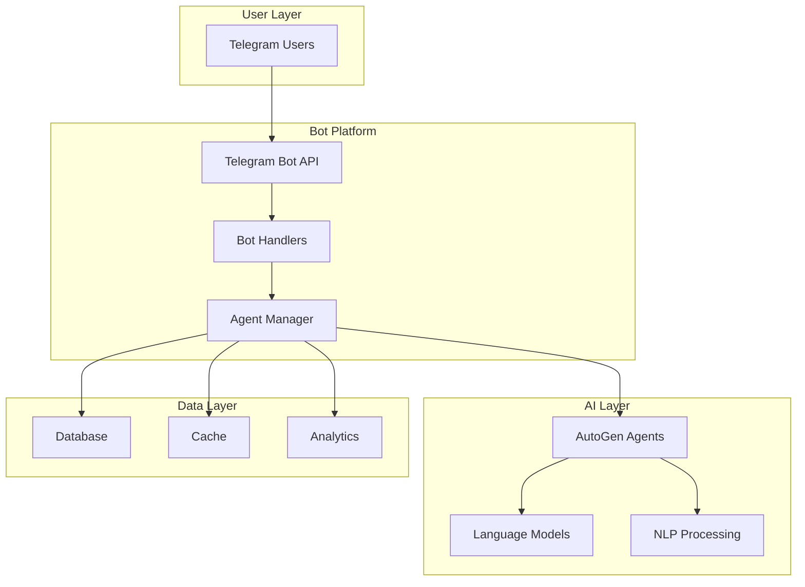

# Telegram Bot Integrations

Transform your business operations with AI-powered Telegram bots that provide intelligent automation, customer service, and educational experiences directly through the familiar Telegram interface.

## 🚀 Available Bot Solutions

### [AI Language Teacher Bot](./language-teacher/overview)
A comprehensive language learning platform that brings personalized AI tutoring to Telegram.

**Key Features:**
- 🗣️ Natural conversation practice with adaptive AI
- 📚 Structured homework and exercises
- 🎤 Voice message analysis and pronunciation feedback
- 📊 Advanced progress tracking and analytics
- 🏆 Gamification with achievements and streaks
- 🌍 Support for 6+ languages

**Perfect for:** Educational institutions, language schools, corporate training programs, and individual learners.

### [Smart Assistant Bot](./smart-assistant/overview)
An intelligent business assistant powered by AutoGen and GPT-4 for automated customer support and research.

**Key Features:**
- 🤖 AutoGen-powered intelligent responses
- 🔍 Multi-agent research capabilities
- 💬 Natural language understanding
- 📈 Conversation management
- 🛠️ Extensible architecture
- 📊 Comprehensive metrics

**Perfect for:** SMEs needing customer support automation, research teams, and businesses requiring intelligent assistants.

## 🎯 Why Choose Our Telegram Bots?

### Instant Deployment
- **No app installation required** - Works directly in Telegram
- **Cross-platform** - Available on all devices
- **Familiar interface** - Users already know how to use Telegram

### Enterprise-Ready
- **Scalable architecture** - Handle thousands of concurrent users
- **Multi-tenant support** - Serve multiple organizations
- **Security-first design** - End-to-end encryption and data privacy
- **GDPR compliant** - Full data protection compliance

### AI-Powered Intelligence
- **Latest LLM models** - GPT-4, Claude, and custom models
- **Adaptive learning** - Personalization based on user behavior
- **Multi-agent systems** - Complex task automation
- **Natural language processing** - Understand context and intent

## 🏢 Industry Applications

### Education Sector
- **Language schools** - Complete digital language learning platform
- **Corporate training** - Employee language skill development
- **Universities** - Supplementary learning tools for students
- **Online courses** - Interactive learning experiences

### Business Automation
- **Customer service** - 24/7 automated support
- **Lead qualification** - Intelligent prospect engagement
- **Appointment scheduling** - Automated booking management
- **FAQ handling** - Instant answers to common questions

### Healthcare & Wellness
- **Patient reminders** - Medication and appointment notifications
- **Health coaching** - Personalized wellness guidance
- **Mental health support** - Initial assessment and resources
- **Symptom checking** - Basic health information

## 🛠️ Technical Architecture

## 📊 Success Metrics

### Language Teacher Bot
- **70%+ user retention** after 7 days
- **80%+ session completion** rate
- **4.8/5 average rating** from users
- **3x faster learning** compared to traditional methods

### Smart Assistant Bot
- **<2 second** average response time
- **95%+ query resolution** rate
- **60% reduction** in support tickets
- **24/7 availability** with no downtime

## 🚀 Getting Started

### Quick Setup (5 minutes)
1. Get a bot token from [@BotFather](https://t.me/botfather)
2. Clone our repository
3. Configure environment variables
4. Launch your bot

### Full Deployment
- Detailed setup guides for each bot
- Docker containers for easy deployment
- Cloud deployment scripts (AWS, GCP, Azure)
- Monitoring and analytics setup

## 💰 Pricing Models

### SaaS Options
- **Starter**: $99/month - Up to 1,000 active users
- **Professional**: $299/month - Up to 10,000 active users
- **Enterprise**: Custom pricing - Unlimited users and features

### Self-Hosted
- **Open source core** - Free forever
- **Premium features** - License-based pricing
- **Custom development** - Tailored solutions

## 🔒 Security & Compliance

- **End-to-end encryption** - Secure communication
- **Data privacy** - User data stays in your control
- **GDPR compliant** - Full regulatory compliance
- **SOC2 ready** - Enterprise security standards
- **Rate limiting** - Protection against abuse
- **Audit logs** - Complete activity tracking

## 📚 Resources

- [Detailed Documentation](./getting-started)
- [API Reference](./api-reference)
- [Best Practices Guide](./best-practices)
- [Video Tutorials](./tutorials)
- [Community Forum](https://community.varga-ai.com)

## 🤝 Support

- **Documentation** - Comprehensive guides and references
- **Community Support** - Active community forum
- **Professional Support** - Dedicated support team
- **Custom Development** - Tailored solutions for your needs

---

Ready to transform your business with AI-powered Telegram bots? [Get Started Now](./getting-started) →