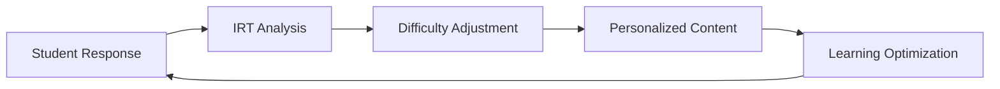

# AI Language Teacher Telegram Bot

Transform language learning with an AI-powered personal tutor available 24/7 on Telegram. Our comprehensive language learning platform combines advanced AI technology with proven pedagogical methods to deliver personalized, adaptive language instruction.

## 🌟 Core Features

### Natural Conversation Practice
Experience authentic language learning through AI-powered conversations that adapt to your level and interests.

- **Adaptive Dialogue**: Conversations adjust difficulty based on your proficiency
- **Contextual Learning**: Learn vocabulary and grammar in real-world contexts
- **Gentle Corrections**: Receive non-intrusive error correction that doesn't interrupt flow
- **Cultural Insights**: Understand language usage in cultural contexts

### Structured Learning Exercises
Comprehensive homework system with exercises tailored to your learning needs.

- **Personalized Assignments**: Exercises based on your progress and weak areas
- **Multiple Exercise Types**: Grammar, vocabulary, reading, writing, listening
- **Immediate Feedback**: Detailed explanations for every answer
- **Progressive Difficulty**: Challenges that grow with your abilities

### Voice & Pronunciation
Master pronunciation with advanced voice analysis and feedback.

- **Speech Recognition**: Analyze pronunciation accuracy
- **Phonetic Guidance**: Learn correct sound production
- **Accent Training**: Improve accent and intonation
- **Speaking Confidence**: Build confidence through practice

## 🧠 Advanced AI Technology

### Adaptive Learning Engine
Our proprietary adaptive learning system uses Item Response Theory (IRT) and Bayesian Knowledge Tracing (BKT) to personalize your learning experience.



### Spaced Repetition System
Optimize memory retention with scientifically-proven spaced repetition algorithms.

- **SM-2+ Algorithm**: Advanced spacing algorithm for optimal retention
- **Automatic Scheduling**: Review reminders at optimal intervals
- **Memory Strength Tracking**: Monitor retention for each concept
- **Adaptive Intervals**: Spacing adjusts to your performance

### Natural Language Processing
State-of-the-art NLP for comprehensive language analysis.

- **Error Detection**: Identify grammar, vocabulary, and usage errors
- **Semantic Analysis**: Understand meaning and context
- **Complexity Assessment**: Evaluate text difficulty and readability
- **Style Suggestions**: Improve writing style and clarity

## 📊 Learning Analytics Dashboard

### Progress Tracking
Monitor your learning journey with detailed analytics:

- **Skill Breakdown**: Track progress in reading, writing, speaking, listening
- **Learning Velocity**: Measure your learning speed and acceleration
- **Accuracy Trends**: Monitor improvement over time
- **Time Investment**: Track study time and session patterns

### Performance Metrics
- **Overall Proficiency**: CEFR-aligned level assessment
- **Vocabulary Size**: Active and passive vocabulary tracking
- **Grammar Mastery**: Detailed grammar concept progress
- **Fluency Score**: Speaking fluency and coherence metrics

## 🏆 Gamification & Motivation

### Achievement System
Stay motivated with our comprehensive achievement system:

**Achievement Categories:**
- 🎯 **Milestone Achievements**: Major learning milestones
- 🔥 **Streak Achievements**: Consistency rewards
- 📚 **Learning Achievements**: Skill-specific badges
- ⭐ **Mastery Achievements**: Excellence recognition

### Progress Rewards
- **Points System**: Earn points for every learning activity
- **Level Progression**: Advance through proficiency levels
- **Leaderboards**: Compare progress with other learners
- **Certificates**: Earn certificates for completed modules

## 🌍 Supported Languages

### Currently Available
- 🇺🇸 **English** - Full feature support
- 🇪🇸 **Spanish** - Complete learning system
- 🇫🇷 **French** - Comprehensive coverage
- 🇩🇪 **German** - Core features
- 🇮🇹 **Italian** - Essential learning
- 🇵🇹 **Portuguese** - Basic support

### Coming Soon
- 🇯🇵 Japanese
- 🇨🇳 Mandarin Chinese
- 🇰🇷 Korean
- 🇷🇺 Russian
- 🇦🇪 Arabic

## 💼 Use Cases

### Individual Learners
- **Self-paced learning** at your convenience
- **Personalized curriculum** based on goals
- **24/7 availability** for flexible scheduling
- **Affordable** compared to traditional tutoring

### Educational Institutions
- **Supplementary learning** for classroom instruction
- **Homework assistance** and practice
- **Progress monitoring** for teachers
- **Scalable solution** for many students

### Corporate Training
- **Employee language training** programs
- **Business language** specialization
- **Team progress tracking** and reporting
- **Cost-effective** training solution

## 🚀 Quick Start Guide

### 1. Bot Setup (2 minutes)
```bash
# Get your bot token from @BotFather on Telegram
# Clone the repository
git clone <repository-url>
cd varga-ai

# Configure environment
cp .env.template .env
# Edit .env with your bot token
```

### 2. Install Dependencies
```bash
# Using uv (recommended)
uv sync

# Or using pip
pip install -r requirements.txt
```

### 3. Launch the Bot
```bash
# Start the language teacher bot
./start_language_teacher.sh

# Or run directly
python language_teacher_bot.py
```

### 4. Start Learning
- Open Telegram and search for your bot
- Send `/start` to begin
- Choose your language and level
- Start practicing!

## 📈 Success Stories

### Case Study: Corporate Language Training
> "We reduced language training costs by 70% while improving employee engagement. The AI tutor is available 24/7, and employees love the flexibility." - *HR Director, Tech Company*

### Case Study: University Integration
> "Our students' language proficiency improved by 35% in one semester. The detailed analytics help us identify struggling students early." - *Language Department Head*

### User Testimonials
- ⭐⭐⭐⭐⭐ "Better than any language app I've tried!"
- ⭐⭐⭐⭐⭐ "The AI conversations feel so natural"
- ⭐⭐⭐⭐⭐ "Love the instant feedback and explanations"

## 🔐 Privacy & Security

- **Data Privacy**: Your learning data stays private and secure
- **Local Processing**: Option for on-premise deployment
- **GDPR Compliant**: Full compliance with data regulations
- **Encrypted Storage**: All data encrypted at rest
- **User Control**: Delete your data anytime

## 📚 Next Steps

- [Detailed Setup Guide](./setup) - Complete installation instructions
- [User Manual](./user-guide) - How to use all features
- [Teacher Dashboard](./teacher-dashboard) - For educators
- [API Documentation](./api) - For developers
- [Best Practices](./best-practices) - Tips for effective learning

---

Ready to start your language learning journey? [Get Started Now](./setup) →