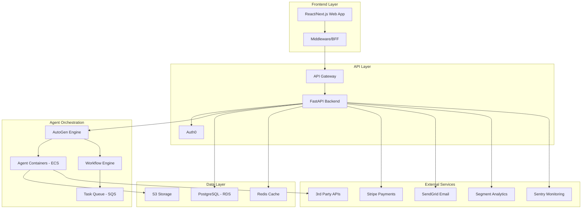
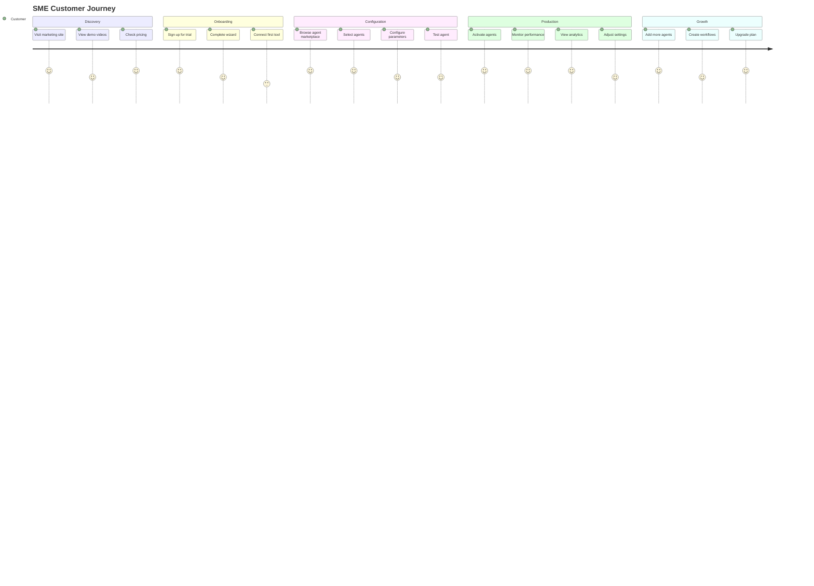
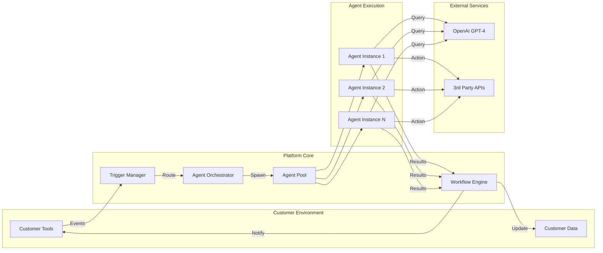
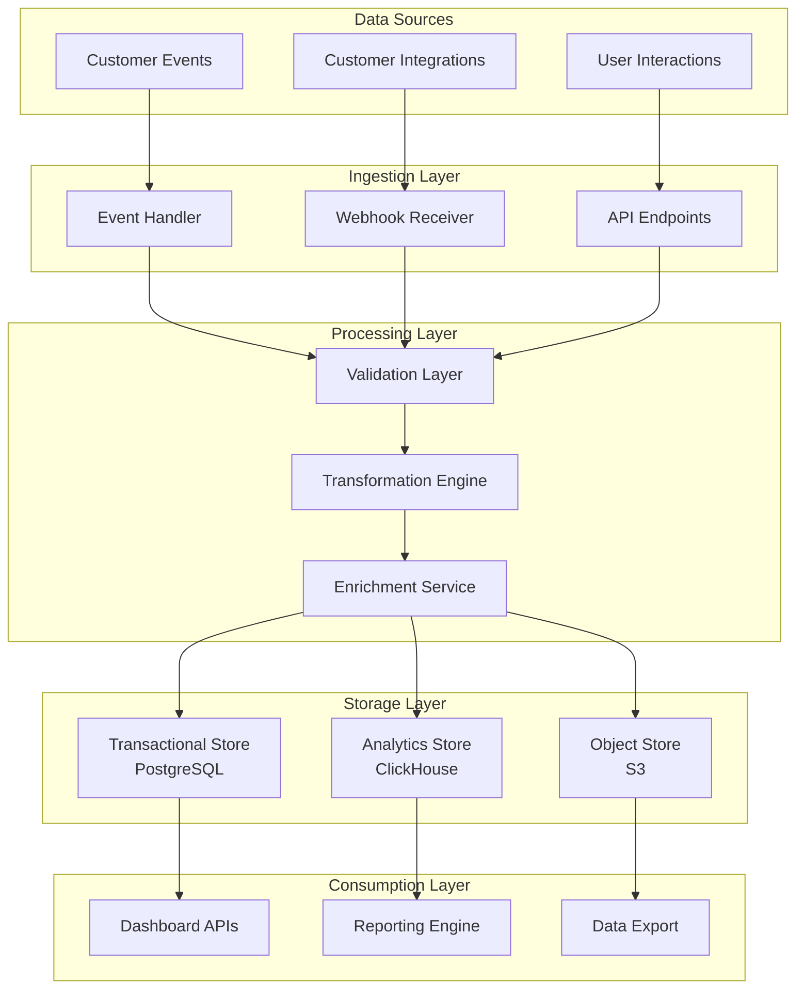

# AutoGen-Based SaaS Platform for SME Automation - Project Brief

## Project Folder Structure

```mermaid
graph TD
    ROOT[varga-ai/]
    
    %% Agents Structure
    ROOT --> AGENTS[agents/]
    AGENTS --> CATEGORIES[categories/]
    AGENTS --> BASE_AGENT[base/]
    AGENTS --> SHARED_AGENT[shared/]
    
    CATEGORIES --> SALES[sales/]
    CATEGORIES --> CUSTSERV[customer_service/]
    CATEGORIES --> OPS[operations/]
    CATEGORIES --> FINANCE[finance/]
    CATEGORIES --> MARKETING[marketing/]
    
    SALES --> LQ[lead_qualifier/]
    SALES --> AS[appointment_scheduler/]
    SALES --> QG[quote_generator/]
    
    LQ --> LQ_FILES[agent.py<br/>config.yaml<br/>prompts/<br/>tools/<br/>tests/]
    
    CUSTSERV --> TH[ticket_handler/]
    CUSTSERV --> FAQ[faq_responder/]
    CUSTSERV --> EM[escalation_manager/]
    
    OPS --> IT[inventory_tracker/]
    OPS --> OP[order_processor/]
    OPS --> WA[workflow_automator/]
    
    FINANCE --> IP[invoice_processor/]
    FINANCE --> ET[expense_tracker/]
    FINANCE --> PR[payment_reminder/]
    
    MARKETING --> CC[content_creator/]
    MARKETING --> SMS[social_media_scheduler/]
    MARKETING --> ECM[email_campaign_manager/]
    
    BASE_AGENT --> BA_FILES[base_agent.py<br/>agent_registry.py<br/>agent_interface.py]
    SHARED_AGENT --> SA_FILES[prompts/<br/>utilities/<br/>validators/]
    
    %% Tools Structure
    ROOT --> TOOLS[tools/]
    TOOLS --> INTEGRATIONS[integrations/]
    TOOLS --> BASE_TOOL[base/]
    TOOLS --> UTILITIES[utilities/]
    
    INTEGRATIONS --> GOOGLE[google/]
    INTEGRATIONS --> MICROSOFT[microsoft/]
    INTEGRATIONS --> CRM[crm/]
    INTEGRATIONS --> ACCOUNTING[accounting/]
    INTEGRATIONS --> COMM[communication/]
    
    GOOGLE --> G_FILES[gmail_tool.py<br/>calendar_tool.py<br/>drive_tool.py]
    MICROSOFT --> M_FILES[outlook_tool.py<br/>teams_tool.py]
    CRM --> CRM_FILES[salesforce_tool.py<br/>hubspot_tool.py]
    ACCOUNTING --> ACC_FILES[quickbooks_tool.py<br/>xero_tool.py]
    COMM --> COMM_FILES[slack_tool.py<br/>twilio_tool.py]
    
    BASE_TOOL --> BT_FILES[base_tool.py<br/>tool_registry.py<br/>tool_interface.py]
    UTILITIES --> U_FILES[auth_manager.py<br/>rate_limiter.py<br/>error_handler.py]
    
    %% Platform Structure
    ROOT --> PLATFORM[platform/]
    PLATFORM --> API[api/]
    PLATFORM --> CORE[core/]
    PLATFORM --> FRONTEND[frontend/]
    PLATFORM --> SHARED_PLAT[shared/]
    
    API --> API_DIRS[routes/<br/>middleware/<br/>schemas/]
    CORE --> CORE_DIRS[orchestrator/<br/>workflow_engine/<br/>task_queue/]
    FRONTEND --> FE_DIRS[components/<br/>pages/<br/>services/]
    SHARED_PLAT --> SP_DIRS[database/<br/>cache/<br/>monitoring/]
    
    %% Workflows Structure
    ROOT --> WORKFLOWS[workflows/]
    WORKFLOWS --> TEMPLATES[templates/]
    WORKFLOWS --> ENGINE[engine/]
    WORKFLOWS --> BUILDER[builder/]
    
    TEMPLATES --> T_FILES[sales_pipeline.yaml<br/>customer_onboarding.yaml<br/>invoice_to_payment.yaml]
    ENGINE --> E_FILES[workflow_executor.py<br/>trigger_manager.py<br/>condition_evaluator.py]
    BUILDER --> B_DIRS[visual_builder/<br/>yaml_parser/]
    
    %% Other Structures
    ROOT --> CONFIG[config/]
    CONFIG --> ENVIRONMENTS[environments/]
    CONFIG --> CONFIG_DIRS[agents/<br/>integrations/]
    ENVIRONMENTS --> ENV_FILES[development.yaml<br/>staging.yaml<br/>production.yaml]
    
    ROOT --> GUTENBERG[gutenberg/]
    GUTENBERG --> GUTEN_DIRS[docs/<br/>blog/<br/>src/<br/>static/]
    
    ROOT --> TESTS[tests/]
    TESTS --> TEST_DIRS[unit/<br/>integration/<br/>e2e/<br/>fixtures/]
    
    ROOT --> SCRIPTS[scripts/]
    SCRIPTS --> SCRIPT_DIRS[deployment/<br/>migration/<br/>maintenance/]
    
    %% Styling
    classDef rootStyle fill:#f9f,stroke:#333,stroke-width:4px
    classDef mainDirStyle fill:#bbf,stroke:#333,stroke-width:2px
    classDef subDirStyle fill:#ddf,stroke:#333,stroke-width:1px
    classDef fileStyle fill:#ffe,stroke:#333,stroke-width:1px
    
    class ROOT rootStyle
    class AGENTS,TOOLS,PLATFORM,WORKFLOWS,CONFIG,GUTENBERG,TESTS,SCRIPTS mainDirStyle
    class CATEGORIES,BASE_AGENT,SHARED_AGENT,INTEGRATIONS,BASE_TOOL,UTILITIES,API,CORE,FRONTEND,SHARED_PLAT,TEMPLATES,ENGINE,BUILDER,ENVIRONMENTS subDirStyle
    class LQ_FILES,BA_FILES,SA_FILES,G_FILES,M_FILES,CRM_FILES,ACC_FILES,COMM_FILES,BT_FILES,U_FILES,API_DIRS,CORE_DIRS,FE_DIRS,SP_DIRS,T_FILES,E_FILES,ENV_FILES fileStyle
```

## Executive Summary

This project aims to build a general-purpose agentic platform leveraging Microsoft's AutoGen framework to provide automated solutions for Small and Medium Enterprises (SMEs) across various industries. The platform will offer pre-built AI agents that handle common business tasks such as customer service, invoicing, appointment scheduling, and more, without requiring customers to create their own agents.

## 1. Project Overview

### Vision
Create a SaaS platform that democratizes AI automation for SMEs by providing ready-to-use AI agents that can be easily configured and integrated with existing business tools.

### Core Value Propositions
- **No-code agent configuration** - SMEs can activate and configure pre-built agents without technical expertise
- **Pre-built templates** for common SME tasks (invoicing, customer service, inventory management)
- **Pay-per-use model** for cost efficiency
- **Quick deployment** capability
- **Seamless integrations** with popular SME tools

### Key Problems Solved
1. Limited IT resources in SMEs
2. High cost of custom automation solutions
3. Complex integration requirements
4. Lack of AI/automation expertise
5. Budget constraints preventing automation adoption

## 2. Stakeholders

### Primary Stakeholders
- **SME Employees** (daily users)
  - Customer service representatives
  - Sales staff
  - Accounting personnel
  - Operations teams
  - Workflow managers
  - *Concerns*: Learning curve, mobile access needs, clear value in daily work

### Secondary Stakeholders
- **C-Suite Executives**
  - *Concerns*: Competitive advantage, compliance adherence, productivity gains
- **Business Analysts & Process Consultants**
  - *Concerns*: Process optimization, reporting capabilities
- **External Consultants**
  - *Concerns*: Implementation support, customization options

### Internal Stakeholders
- **Engineering Team** - Core development
- **AI/ML Engineers** - Agent optimization
- **Customer Success Team** - User onboarding and support
- **UX Designers** - Platform usability
- **Marketing Team** - Market positioning
- **Support Team** - Technical assistance

### External Stakeholders
- **Technology Partners**
  - Microsoft/AutoGen team
  - Integration marketplace partners
  - Industry-specific software vendors
- **Compliance Auditors**
- **Cybersecurity Assessors**

## 3. Project Scope

### In Scope (MVP)
1. **Agent Marketplace**
   - 25-30 pre-built agents covering top SME pain points
   - 5 main categories: Sales, Customer Service, Operations, Finance, Marketing
   - Search/filter by industry, function, and use case
   - Detailed agent descriptions and demos

2. **Agent Configuration**
   - Basic parameter configuration via intuitive forms
   - Guided configuration wizards with templates
   - Business rules editor for advanced users
   - Preset templates for common scenarios

3. **Workflow Orchestration**
   - Visual workflow builder for multi-agent processes
   - Pre-built workflow templates
   - Drag-and-drop editor for custom flows
   - Trigger-action chains

4. **Integrations**
   - Gmail & Outlook
   - Slack
   - QuickBooks & other accounting tools
   - Shopify
   - Google Workspace & Microsoft 365
   - Popular CRMs (HubSpot, Salesforce)
   - Simple OAuth connections

5. **Analytics & Monitoring**
   - Real-time dashboards
   - Task completion rates
   - Time saved metrics
   - Error logs and debugging
   - Cost tracking
   - ROI calculator
   - Agent performance metrics

6. **Platform Infrastructure**
   - Multi-tenant SaaS platform
   - Customer portal
   - REST API for developers
   - Usage-based billing system

### Out of Scope (Future Phases)
- Customer-created custom agents
- Native mobile applications
- White-labeling capabilities
- On-premise deployment
- Source code access
- Enterprise SSO (initially)
- Multi-language support
- Phone support

## 4. Technical Architecture

### Technology Stack
- **Frontend**: React/Next.js with TypeScript
- **Backend**: Python with FastAPI
- **Database**: PostgreSQL (RDS) + Redis for caching
- **Agent Runtime**: AutoGen in Docker containers
- **Infrastructure**: AWS (ECS, RDS, S3, CloudWatch)
- **Multi-tenancy**: Schema-based isolation
- **CI/CD**: GitHub Actions
- **Monitoring**: CloudWatch, Sentry
- **Analytics**: Segment

### Key Architectural Decisions
- Containerized AutoGen agents for isolation and scalability
- Schema-based multi-tenancy for data isolation
- Event-driven architecture for workflow orchestration
- Microservices approach for modularity
- API-first design for extensibility

## 5. User Journey

## 6. Agent Workflow Architecture

## 7. Non-Functional Requirements

### Performance
- API response time: <2 seconds
- Support for 5,000 concurrent users
- Handle 500K daily agent tasks
- Real-time agent response capabilities

### Security & Compliance
- End-to-end encryption (TLS 1.3)
- OAuth2/SSO support via Auth0
- SOC2 compliance requirements
- GDPR compliance
- Role-based access control
- Comprehensive audit logs

### Scalability
- Handle 10x growth without architecture changes
- Multi-tenant isolation
- Support for US/EU regions
- Horizontal scaling capabilities
- Queue-based architecture for agent tasks

### Availability
- 99.9% uptime SLA
- Zero-downtime deployments
- Automated failover
- 4-hour RTO (Recovery Time Objective)

### Usability
- Intuitive setup process
- Video tutorials and guided tours
- WCAG 2.1 AA compliance
- Mobile-responsive design
- In-app contextual help

## 8. Risk Analysis & Mitigation

### Technical Risks
- **Multi-tenancy bugs**
  - *Mitigation*: Comprehensive testing suite, isolation testing
- **Agent errors damaging customer data**
  - *Mitigation*: Sandboxed execution, rollback capabilities
- **AutoGen scalability issues**
  - *Mitigation*: Load testing, performance optimization

### Business Risks
- **Building trust with SMEs**
  - *Mitigation*: Case studies, free trials, testimonials
- **Demonstrating clear ROI**
  - *Mitigation*: ROI calculator, success metrics dashboard

### Operational Risks
- **Platform stability while iterating fast**
  - *Mitigation*: Dedicated DevOps hire, staged rollouts
- **Documentation debt**
  - *Mitigation*: Documentation sprints, automated docs generation

## 9. Dependencies

### External APIs & Services
- **Core Integrations**: Google Workspace, Microsoft 365, Slack, QuickBooks
- **Payment Processing**: Stripe
- **Email Service**: SendGrid
- **Authentication**: Auth0
- **Analytics**: Segment
- **Error Monitoring**: Sentry

### AutoGen Requirements
- Latest stable version of AutoGen
- OpenAI GPT-4 API access
- Containerized deployment capability

### Infrastructure Dependencies
- AWS Services: ECS, RDS, S3, CloudWatch, SQS
- GitHub for source control
- GitHub Actions for CI/CD

## 10. Deliverables

### MVP Platform Components
1. Multi-tenant SaaS platform
2. Agent marketplace with search/filter
3. Customer portal with dashboard
4. REST API for developers
5. Visual workflow builder
6. Analytics and monitoring dashboard
7. Billing and subscription management

### Agent Library
- 25 production-ready agents across 5 categories
- Full documentation for each agent
- Configuration templates
- Performance benchmarks

### Documentation
- Comprehensive user manual
- Developer guide and API reference
- Best practices guide
- Video tutorials
- Troubleshooting knowledge base

### Launch Assets
- Marketing website
- Self-service onboarding wizard
- Help center/knowledge base
- System status page
- Demo environment

### Quality Criteria
- Zero critical bugs
- 99% uptime in staging environment
- Security audit passed
- Load tested to 2x expected capacity
- 80% automated test coverage

## 11. Data Flow Architecture

## Conclusion

This project aims to revolutionize how SMEs approach automation by providing an accessible and powerful platform built on Microsoft's AutoGen framework. With a clear focus on user-centric design and scalable architecture, the platform is positioned to capture a significant share of the growing SME automation market.

The combination of pre-built agents, intuitive configuration, and seamless integrations addresses the core pain points of SMEs while maintaining the flexibility to grow and adapt to changing market needs. Success will be measured in the tangible time savings and efficiency gains delivered to our customers.